# DropoutGuard — Proposed System Architecture Specification
### Enterprise Architectural Diagram & Structural Breakdown for SIH 2026 (PSID 7-L)
**Team Name**: COGNITEX | **Team ID**: 107  
**Interactive Viewer**: [docs/architecture/system_architecture.html](../../docs/architecture/system_architecture.html)  
**Vector Graphic (SVG)**: [docs/architecture/proposed_system_architecture.svg](../../docs/architecture/proposed_system_architecture.svg)

---

## 🏛️ Comprehensive Architecture Diagram (Mermaid)

```mermaid
graph TD
    %% ================= ONBOARDING & AUTHENTICATION =================
    subgraph Onboarding ["1. User Onboarding & Authentication"]
        Reg["Registration Process<br/>• Full Name & Student/Faculty ID<br/>• University Email & Department<br/>• Role Selection & 2FA Setup"]
        Login["Login Process<br/>• Username / Email / ID<br/>• Password Authentication<br/>• OTP / 2FA Verification"]
        Decision{"Already<br/>Registered?"}
        Gateway["RESTful API Gateway<br/>(FastAPI /api/v1/)"]
        AuthMod["Authentication Module<br/>• JWT Tokens & Session Mgmt<br/>• Role-Based Access Control (RBAC)<br/>• Institutional SSO"]
        Users["👥 Users Entity"]
        RoleStudent["Students"]
        RoleMentor["Faculty Mentors / Counselors"]
        RoleAdmin["Dean / HOD / Admin"]
    end

    Reg --> Decision
    Login --> Decision
    Decision -->|No| Reg
    Decision -->|Yes - Verify Credentials| Gateway
    Gateway --> AuthMod
    AuthMod --> Users
    Users --> RoleStudent
    Users --> RoleMentor
    Users --> RoleAdmin

    %% ================= DASHBOARDS LAYER =================
    subgraph Dashboards ["2. Role-Based Dashboards (React 18 + Vite)"]
        DashStudent["Student Dashboard<br/>• Attendance Tracker (75% Rule)<br/>• Real-Time Dropout Risk Gauge<br/>• 'Path to Improvement' Recourse<br/>• Mentor Booking & Aid Hub"]
        DashMentor["Faculty Mentor / Counselor<br/>• Prioritised Triage Queue (High/Med/Low)<br/>• TreeSHAP Waterfall Explanation<br/>• 12-Item Codified Action Catalog<br/>• Intervention Lifecycle Tracker<br/>• Student Case Notes & Logs"]
        DashAdmin["Admin / Dean / HOD Dashboard<br/>• Department Risk Heatmaps (CS/ME/EC)<br/>• NAAC/NIRF Graduation Predictor<br/>• Cohort Batch CSV Ingestion<br/>• Retention ROI & Arrears Monitor"]
    end

    RoleStudent -.->|Authenticated Session| DashStudent
    RoleMentor -.->|Authenticated Session| DashMentor
    RoleAdmin -.->|Authenticated Session| DashAdmin

    %% ================= CORE FEATURES MATRIX =================
    subgraph CoreFeatures ["3. Core Feature Modules"]
        subgraph FeatStudent ["Student Modules"]
            F_Att["Attendance Debarment Alert (75% Rule)"]
            F_Rec["Counterfactual Recourse ('Path to Improvement')"]
            F_Aid["Emergency Support & Fee Waiver Desk"]
            F_LMS["Digital LMS Tracker (Logins & Lag)"]
            F_Backlog["Backlog Recovery & Remedial Strategy"]
            F_Peer["Department Peer Mentorship Connect"]
        end

        subgraph FeatMentor ["Counselor / Mentor Modules"]
            F_Triage["Prioritised Triage Queue (Risk Sorted)"]
            F_SHAP["Explainable AI Feed (TreeSHAP Waterfall)"]
            F_Catalog["Prescriptive Action Hub (12 Codified Actions)"]
            F_Tracker["Intervention Lifecycle Tracker (Assigned->Done)"]
            F_Notes["Counselor Confidential Case Notes"]
            F_Sim["Interactive Recourse Risk Slider Simulator"]
        end

        subgraph FeatAdmin ["Admin & Executive Modules"]
            F_Heatmap["Department-wide Risk Heatmaps"]
            F_ROI["Retention ROI & Preserved Revenue Tracker"]
            F_Accred["NAAC / NIRF Graduation Outcome Predictor"]
            F_Batch["Cohort CSV Batch Importer (2000+ Students)"]
            F_Fairness["Algorithmic Fairness Audit Matrix (FNR <= 1.36 pp)"]
            F_Audit["Audit Logs & DPDP Privacy Compliance"]
        end
    end

    DashStudent --> FeatStudent
    DashMentor --> FeatMentor
    DashAdmin --> FeatAdmin

    %% ================= DATABASE LAYER =================
    subgraph DatabaseLayer ["4. Unified Database Layer (PostgreSQL / SQLite)"]
        DB_Rel["Relational DB<br/>• Students & Profiles<br/>• Demographics<br/>• Academic Marks & CGPA"]
        DB_Pred["Prediction Store<br/>• Calibrated Risk Probs<br/>• Risk Tier Snapshots<br/>• TreeSHAP Attributions"]
        DB_Logs["Intervention Logs<br/>• Assigned Mentor ID<br/>• Status Lifecycle<br/>• Counselor Case Notes<br/>• Follow-up Schedules"]
        DB_Files["File & Batch Store<br/>• 12-Item Action Catalog<br/>• Batch CSV Cohort Files<br/>• Serialized .joblib Models"]
    end

    %% ================= AI/ML ANALYTICS CORE =================
    subgraph MLAnalyticsCore ["5. AI / ML & Analytics Core (ml/)"]
        ML_FE["1. Feature Transformer<br/>• 37 Predictor Features<br/>• 4 Interaction Terms<br/>• Zero Target Leakage"]
        ML_XGB["2. Calibrated XGBoost<br/>• Cost-Sensitive (SMOTE)<br/>• Platt Sigmoid Scaling (5-Fold)<br/>• Metrics: see README (simulated cohort)"]
        ML_SHAP["3. TreeSHAP XAI<br/>• Exact Tree Attribution (+/- pp)<br/>• Plain-Language Translator<br/>• Synchronous Explainer Cache"]
        ML_Recourse["4. Recourse Optimizer<br/>• Path to Improvement Solver<br/>• 12-Item Action Mapping<br/>• Quantitative Fairness Parity"]
    end

    %% ================= EXTERNAL SERVICES =================
    subgraph ExternalServices ["6. External Services & APIs"]
        Ext_ERP["Campus ERP & SIS Connector<br/>• Biometric Attendance Daily Feed<br/>• Exam Branch Grades & Backlogs<br/>• Tuition Fee Arrears & Overdue Days"]
        Ext_Alert["Automated Alerts & SMS API<br/>• Guardian SMS on <75% Debarment<br/>• Mentor Calendar Consultation Push<br/>• Fee Hardship Desk Alerts"]
        Ext_LMS["LMS Connector (Moodle/Canvas)<br/>• Weekly Logins & Submission Lag<br/>• Syllabus Resource Download Hits"]
    end

    %% ================= CONNECTING FLOWS =================
    ExternalServices -->|Scheduled Sync| DatabaseLayer
    DatabaseLayer <-->|Stores & Reads Features/Logs| MLAnalyticsCore
    MLAnalyticsCore -.->|Real-Time Inference, SHAP Drivers & Recourse| CoreFeatures
```

---

## 🧩 Architectural Component Descriptions

### 1. User Onboarding & Authentication Flow (Left Section)
- **Registration & Login**: Captures role attributes (Student, Faculty Mentor, Counselor, Head of Department/Dean).
- **Security**: JWT-based session tokens with Role-Based Access Control (RBAC) and 2-Factor Authentication (OTP).

### 2. Role-Based Dashboards (Middle Top Section)
- **Student Dashboard**: Transparent, empathetic interface showing attendance velocity against the statutory 75% rule, real-time risk tier, and the personalized counterfactual "Path to Improvement".
- **Faculty Mentor / Counselor Dashboard**: Prioritized triage queue sorted by descending risk, accompanied by the TreeSHAP waterfall explanation card and the 12-item institutional intervention tracker.
- **Admin / Dean Dashboard**: Institute-level risk heatmaps across academic departments (CS, ME, EC, CE, IT), cohort batch CSV ingestion, and NAAC/NIRF retention projections.

### 3. Core Feature Matrix (Right Section)
- **Student Features**: Early Debarment Warnings, Counterfactual Recourse, Emergency Hardship Support Desk, Backlog Clearance Strategy, and Peer Tutoring Connect.
- **Mentor Features**: Risk-Sorted Triage Queue, TreeSHAP Feature Attribution Waterfall, 12 Codified Actions, Intervention Lifecycle Tracker, and Interactive Risk Slider Simulator.
- **Executive Features**: Department Risk Heatmaps, Tuition Revenue Protection ROI, Accreditation Predictor, Cohort Batch Processing, and Fairness Parity Audits.

### 4. Unified Database Layer (Bottom Middle Section)
- **Relational DB**: Stores student profiles, demographic indicators, attendance records, and exam branch CGPA/backlogs.
- **Prediction Store**: Persists calibrated risk probabilities ($[0.0, 1.0]$), historical risk tiers (`Low`, `Medium`, `High`), and raw TreeSHAP attribution vectors.
- **Intervention Logs**: Manages the state machine lifecycle (`ASSIGNED` $\to$ `IN_PROGRESS` $\to$ `APPLIED` $\to$ `COMPLETED` $\to$ `CANCELLED`).
- **File & Model Store**: Houses serialized `.joblib` model artifacts (`calibrated_model.joblib`, `shap_explainer.joblib`) and uploaded CSV batches.

### 5. AI / ML & Analytics Core (Bottom Right Section)
- **4-Pillar Feature Engine**: Computes 37 domain predictors and non-linear interactions (*Absenteeism × Fee Delay*, *CGPA Deficit × Backlogs*).
- **Cost-Sensitive XGBoost & Platt Calibrator**: current values are in the generated metrics block in the README, section [Pipeline validation on simulated data](../../README.md). These metrics come from a simulated cohort and validate the pipeline, not real-world accuracy.
- **TreeSHAP Explainability Engine**: Computes signed percentage-point attributions and plain-language sentences in $<50\text{ms}$ per student.
- **Counterfactual Recourse Engine**: Multi-objective optimization solving for the minimal achievable feature deltas required to transition a student to Low Risk.

### 6. External Services & APIs (Bottom Left Section)
- **Campus ERP / SIS Connector**: Daily sync of biometric attendance feeds, exam marks, and fee payment delays.
- **LMS Connector**: Ingests clickstreams, weekly login frequency, and assignment submission timestamps from Moodle, Canvas, or Google Classroom.
- **Automated Alerts & SMS API**: Triggers guardian notifications when attendance drops below 75% and sends mentor consultation calendar invites.
