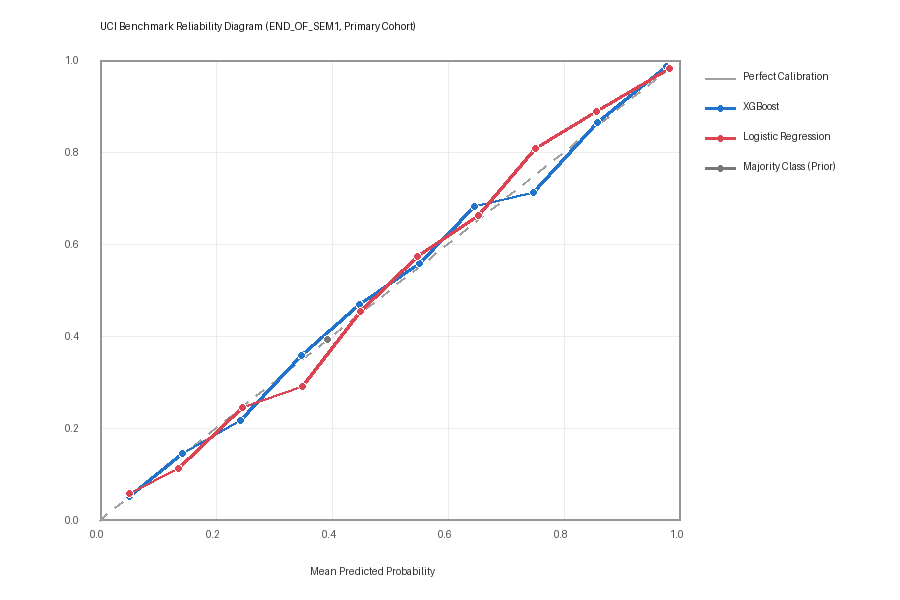
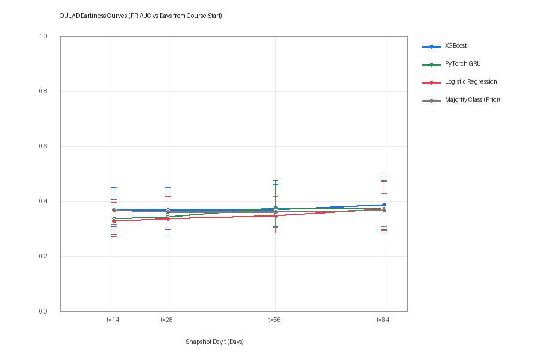

# Real-Data Benchmark Evaluation Report

> Rigorous, leak-free empirical evaluation on official educational benchmarks: UCI ID 697 and OULAD (UCI ID 349).
> Conducted via the standardized evaluation harness across temporal holdouts, Leave-One-Course/Module-Out, and repeated cross-validation.
> Point estimates and 95% bootstrap confidence intervals (1,000 resamples of out-of-fold predictions).

---

## 1. Portuguese Higher Education Benchmark (UCI ID 697)

- **Dataset**: UCI ID 697 ($N = 4,424$, 17 Degree Programs / Courses)
- **Feature Sets**:
  - `ENROLMENT_TIME`: Baseline features available at matriculation (admission credentials, family background, socio-economic signals, macroeconomic indicators; 22 features).
  - `END_OF_SEM1`: `ENROLMENT_TIME` + 1st-semester curricular unit evaluations and approved units (28 features). Zero 2nd-semester features.
  - `FULL`: Everything, including 2nd-semester curricular units (34 features). Explicitly labeled as **not early warning**.
- **Protected attributes** (`gender`, `age_at_enrollment`) are not model features in any set (see `ml/fairness/attributes.py`).
- **Label Variants**:
  - `Primary`: Binary outcome ($N = 3,630$). `Dropout = 1` vs `Graduate = 0`. Students with `Target == 'Enrolled'` are excluded.
  - `Sensitivity`: Binary outcome ($N = 4,424$). `Dropout = 1` vs `Graduate / Enrolled = 0`. Students with `Target == 'Enrolled'` are coded as $0$.

### Reliability & Probability Calibration

---

### UCI Primary Cohort Evaluation (Dropout vs Graduate, N = 3,630)

Excludes active Enrolled students (1,421 Dropouts, 2,209 Graduates; Prevalence = 39.15%).

#### Repeated Stratified 5-Fold CV (3 repeats)

| Feature Set | Model | ROC-AUC (95% CI) | PR-AUC (95% CI) | Top 10% Prec (95% CI) | Top 10% Recall (95% CI) | Top 20% Prec (95% CI) | Top 20% Recall (95% CI) | Brier Score (95% CI) | ECE (95% CI) |
| :--- | :--- | :--- | :--- | :--- | :--- | :--- | :--- | :--- | :--- |
| ENROLMENT_TIME (Admission / Baseline) | Majority Class (Prior) | 0.5012 [0.4844, 0.5191] | 0.3924 [0.3747, 0.4103] | 0.3912 [0.3499, 0.4490] | 0.0999 [0.0894, 0.1134] | 0.4022 [0.3595, 0.4284] | 0.2055 [0.1859, 0.2176] | 0.2382 [0.2347, 0.2419] | 0.0000 [0.0000, 0.0187] |
| ENROLMENT_TIME (Admission / Baseline) | Logistic Regression | 0.8044 [0.7896, 0.8183] | 0.7668 [0.7434, 0.7875] | 0.9780 [0.9587, 0.9945] | 0.2498 [0.2403, 0.2596] | 0.8388 [0.8072, 0.8678] | 0.4286 [0.4139, 0.4450] | 0.1671 [0.1607, 0.1733] | 0.0221 [0.0156, 0.0367] |
| ENROLMENT_TIME (Admission / Baseline) | XGBoost | 0.8516 [0.8382, 0.8644] | 0.8227 [0.8046, 0.8387] | 0.9835 [0.9697, 0.9972] | 0.2512 [0.2422, 0.2616] | 0.9022 [0.8747, 0.9256] | 0.4609 [0.4435, 0.4783] | 0.1463 [0.1396, 0.1530] | 0.0172 [0.0136, 0.0325] |
| END_OF_SEM1 (First Semester Completed) | Majority Class (Prior) | 0.5012 [0.4844, 0.5191] | 0.3924 [0.3747, 0.4103] | 0.3912 [0.3499, 0.4490] | 0.0999 [0.0894, 0.1134] | 0.4022 [0.3595, 0.4284] | 0.2055 [0.1859, 0.2176] | 0.2382 [0.2347, 0.2419] | 0.0000 [0.0000, 0.0187] |
| END_OF_SEM1 (First Semester Completed) | Logistic Regression | 0.9334 [0.9242, 0.9422] | 0.9279 [0.9178, 0.9373] | 0.9945 [0.9862, 1.0000] | 0.2540 [0.2438, 0.2654] | 0.9876 [0.9793, 0.9959] | 0.5046 [0.4865, 0.5262] | 0.0870 [0.0804, 0.0933] | 0.0119 [0.0101, 0.0242] |
| END_OF_SEM1 (First Semester Completed) | XGBoost | 0.9403 [0.9320, 0.9480] | 0.9343 [0.9250, 0.9427] | 0.9972 [0.9890, 1.0000] | 0.2548 [0.2447, 0.2659] | 0.9945 [0.9876, 1.0000] | 0.5081 [0.4885, 0.5290] | 0.0832 [0.0767, 0.0898] | 0.0067 [0.0067, 0.0200] |
| FULL (not early warning) | Majority Class (Prior) | 0.5012 [0.4844, 0.5191] | 0.3924 [0.3747, 0.4103] | 0.3912 [0.3499, 0.4490] | 0.0999 [0.0894, 0.1134] | 0.4022 [0.3595, 0.4284] | 0.2055 [0.1859, 0.2176] | 0.2382 [0.2347, 0.2419] | 0.0000 [0.0000, 0.0187] |
| FULL (not early warning) | Logistic Regression | 0.9525 [0.9449, 0.9599] | 0.9503 [0.9427, 0.9574] | 1.0000 [1.0000, 1.0000] | 0.2555 [0.2449, 0.2665] | 0.9972 [0.9917, 1.0000] | 0.5095 [0.4892, 0.5316] | 0.0691 [0.0633, 0.0750] | 0.0136 [0.0092, 0.0239] |
| FULL (not early warning) | XGBoost | 0.9588 [0.9521, 0.9652] | 0.9550 [0.9480, 0.9612] | 1.0000 [1.0000, 1.0000] | 0.2555 [0.2449, 0.2665] | 0.9986 [0.9945, 1.0000] | 0.5102 [0.4895, 0.5324] | 0.0673 [0.0618, 0.0736] | 0.0153 [0.0124, 0.0255] |

#### Leave-One-Course-Out: per-fold mean ± SD (primary)

Each held-out course is scored on its own; values are mean ± SD across folds. k = folds where the metric is defined (single-class folds have no ROC-AUC/PR-AUC).

| Setting | Model | ROC-AUC | PR-AUC | Top 10% Prec | Top 10% Recall | Top 20% Prec | Top 20% Recall | Brier Score | ECE |
| :--- | :--- | :--- | :--- | :--- | :--- | :--- | :--- | :--- | :--- |
| ENROLMENT_TIME (Admission / Baseline) | Majority Class (Prior) | 0.5000 ± 0.0000 (k=17/17) | 0.4805 ± 0.2011 (k=17/17) | 0.4452 ± 0.2383 (k=17/17) | 0.0939 ± 0.0252 (k=17/17) | 0.4663 ± 0.2346 (k=17/17) | 0.1966 ± 0.0418 (k=17/17) | 0.2615 ± 0.0438 (k=17/17) | 0.1731 ± 0.1457 (k=17/17) |
| ENROLMENT_TIME (Admission / Baseline) | Logistic Regression | 0.8070 ± 0.0583 (k=17/17) | 0.7944 ± 0.1180 (k=17/17) | 0.9315 ± 0.1240 (k=17/17) | 0.2262 ± 0.0705 (k=17/17) | 0.8474 ± 0.1686 (k=17/17) | 0.3933 ± 0.0926 (k=17/17) | 0.1872 ± 0.0496 (k=17/17) | 0.1459 ± 0.0905 (k=17/17) |
| ENROLMENT_TIME (Admission / Baseline) | XGBoost | 0.8117 ± 0.0351 (k=17/17) | 0.8075 ± 0.1139 (k=17/17) | 0.9453 ± 0.1098 (k=17/17) | 0.2315 ± 0.0771 (k=17/17) | 0.8531 ± 0.1728 (k=17/17) | 0.3949 ± 0.0918 (k=17/17) | 0.1807 ± 0.0486 (k=17/17) | 0.1453 ± 0.0893 (k=17/17) |
| END_OF_SEM1 (First Semester Completed) | Majority Class (Prior) | 0.5000 ± 0.0000 (k=17/17) | 0.4805 ± 0.2011 (k=17/17) | 0.4452 ± 0.2383 (k=17/17) | 0.0939 ± 0.0252 (k=17/17) | 0.4663 ± 0.2346 (k=17/17) | 0.1966 ± 0.0418 (k=17/17) | 0.2615 ± 0.0438 (k=17/17) | 0.1731 ± 0.1457 (k=17/17) |
| END_OF_SEM1 (First Semester Completed) | Logistic Regression | 0.9262 ± 0.0518 (k=17/17) | 0.9244 ± 0.0684 (k=17/17) | 0.9853 ± 0.0415 (k=17/17) | 0.2530 ± 0.1237 (k=17/17) | 0.9516 ± 0.0952 (k=17/17) | 0.4632 ± 0.1628 (k=17/17) | 0.1094 ± 0.0652 (k=17/17) | 0.1019 ± 0.0847 (k=17/17) |
| END_OF_SEM1 (First Semester Completed) | XGBoost | 0.9190 ± 0.0622 (k=17/17) | 0.9186 ± 0.0781 (k=17/17) | 0.9838 ± 0.0546 (k=17/17) | 0.2524 ± 0.1232 (k=17/17) | 0.9412 ± 0.1086 (k=17/17) | 0.4588 ± 0.1658 (k=17/17) | 0.1153 ± 0.0842 (k=17/17) | 0.1088 ± 0.0930 (k=17/17) |
| FULL (not early warning) | Majority Class (Prior) | 0.5000 ± 0.0000 (k=17/17) | 0.4805 ± 0.2011 (k=17/17) | 0.4452 ± 0.2383 (k=17/17) | 0.0939 ± 0.0252 (k=17/17) | 0.4663 ± 0.2346 (k=17/17) | 0.1966 ± 0.0418 (k=17/17) | 0.2615 ± 0.0438 (k=17/17) | 0.1731 ± 0.1457 (k=17/17) |
| FULL (not early warning) | Logistic Regression | 0.9467 ± 0.0511 (k=17/17) | 0.9439 ± 0.0652 (k=17/17) | 0.9884 ± 0.0407 (k=17/17) | 0.2533 ± 0.1220 (k=17/17) | 0.9610 ± 0.0828 (k=17/17) | 0.4730 ± 0.1834 (k=17/17) | 0.0782 ± 0.0532 (k=17/17) | 0.0766 ± 0.0575 (k=17/17) |
| FULL (not early warning) | XGBoost | 0.9420 ± 0.0723 (k=17/17) | 0.9388 ± 0.0839 (k=17/17) | 0.9902 ± 0.0404 (k=17/17) | 0.2542 ± 0.1238 (k=17/17) | 0.9610 ± 0.0802 (k=17/17) | 0.4732 ± 0.1844 (k=17/17) | 0.0894 ± 0.0931 (k=17/17) | 0.0838 ± 0.0957 (k=17/17) |

#### Leave-One-Course-Out: pooled out-of-fold (secondary)

Out-of-fold predictions from all held-out courses pooled before scoring, which compares scores across courses. Shown for reference only; not the primary LOGO estimate.

| Setting | Model | ROC-AUC (95% CI) | PR-AUC (95% CI) | Top 10% Prec (95% CI) | Top 10% Recall (95% CI) | Top 20% Prec (95% CI) | Top 20% Recall (95% CI) | Brier Score (95% CI) | ECE (95% CI) |
| :--- | :--- | :--- | :--- | :--- | :--- | :--- | :--- | :--- | :--- |
| ENROLMENT_TIME (Admission / Baseline) | Majority Class (Prior) | 0.3056 [0.2890, 0.3223] | 0.2943 [0.2794, 0.3095] | 0.1901 [0.1377, 0.2149] | 0.0486 [0.0356, 0.0549] | 0.1736 [0.1501, 0.2080] | 0.0887 [0.0778, 0.1053] | 0.2446 [0.2412, 0.2480] | 0.1230 [0.1075, 0.1390] |
| ENROLMENT_TIME (Admission / Baseline) | Logistic Regression | 0.7685 [0.7516, 0.7839] | 0.7336 [0.7093, 0.7546] | 0.9780 [0.9532, 0.9917] | 0.2498 [0.2398, 0.2592] | 0.8044 [0.7686, 0.8320] | 0.4110 [0.3938, 0.4262] | 0.1795 [0.1724, 0.1863] | 0.0422 [0.0321, 0.0575] |
| ENROLMENT_TIME (Admission / Baseline) | XGBoost | 0.7914 [0.7758, 0.8078] | 0.7614 [0.7392, 0.7818] | 0.9807 [0.9614, 0.9917] | 0.2505 [0.2404, 0.2606] | 0.8416 [0.8044, 0.8691] | 0.4300 [0.4125, 0.4458] | 0.1753 [0.1675, 0.1824] | 0.0532 [0.0444, 0.0687] |
| END_OF_SEM1 (First Semester Completed) | Majority Class (Prior) | 0.3056 [0.2890, 0.3223] | 0.2943 [0.2794, 0.3095] | 0.1901 [0.1377, 0.2149] | 0.0486 [0.0356, 0.0549] | 0.1736 [0.1501, 0.2080] | 0.0887 [0.0778, 0.1053] | 0.2446 [0.2412, 0.2480] | 0.1230 [0.1075, 0.1390] |
| END_OF_SEM1 (First Semester Completed) | Logistic Regression | 0.9279 [0.9182, 0.9370] | 0.9211 [0.9105, 0.9312] | 0.9945 [0.9862, 1.0000] | 0.2540 [0.2438, 0.2654] | 0.9876 [0.9780, 0.9959] | 0.5046 [0.4852, 0.5262] | 0.0924 [0.0855, 0.0993] | 0.0181 [0.0133, 0.0299] |
| END_OF_SEM1 (First Semester Completed) | XGBoost | 0.9156 [0.9048, 0.9249] | 0.8978 [0.8843, 0.9095] | 0.9917 [0.9807, 1.0000] | 0.2533 [0.2443, 0.2646] | 0.9463 [0.9229, 0.9669] | 0.4835 [0.4680, 0.5000] | 0.1055 [0.0979, 0.1136] | 0.0362 [0.0300, 0.0488] |
| FULL (not early warning) | Majority Class (Prior) | 0.3056 [0.2890, 0.3223] | 0.2943 [0.2794, 0.3095] | 0.1901 [0.1377, 0.2149] | 0.0486 [0.0356, 0.0549] | 0.1736 [0.1501, 0.2080] | 0.0887 [0.0778, 0.1053] | 0.2446 [0.2412, 0.2480] | 0.1230 [0.1075, 0.1390] |
| FULL (not early warning) | Logistic Regression | 0.9448 [0.9367, 0.9533] | 0.9426 [0.9340, 0.9509] | 0.9972 [0.9890, 1.0000] | 0.2548 [0.2443, 0.2659] | 0.9972 [0.9931, 1.0000] | 0.5095 [0.4892, 0.5319] | 0.0753 [0.0691, 0.0819] | 0.0184 [0.0141, 0.0301] |
| FULL (not early warning) | XGBoost | 0.9282 [0.9186, 0.9373] | 0.8611 [0.8392, 0.8829] | 0.8237 [0.7823, 0.8596] | 0.2104 [0.1976, 0.2218] | 0.8967 [0.8733, 0.9187] | 0.4581 [0.4365, 0.4804] | 0.0861 [0.0790, 0.0941] | 0.0311 [0.0257, 0.0419] |

---

### UCI Sensitivity Cohort Evaluation (Enrolled as Negative, N = 4,424)

Treats Enrolled students as non-dropouts (1,421 Dropouts, 3,003 Non-Dropouts; Prevalence = 32.12%).

#### Repeated Stratified 5-Fold CV (3 repeats)

| Feature Set | Model | ROC-AUC (95% CI) | PR-AUC (95% CI) | Top 10% Prec (95% CI) | Top 10% Recall (95% CI) | Top 20% Prec (95% CI) | Top 20% Recall (95% CI) | Brier Score (95% CI) | ECE (95% CI) |
| :--- | :--- | :--- | :--- | :--- | :--- | :--- | :--- | :--- | :--- |
| ENROLMENT_TIME (Admission / Baseline) | Majority Class (Prior) | 0.5032 [0.4847, 0.5219] | 0.3242 [0.3074, 0.3433] | 0.3341 [0.2889, 0.3792] | 0.1042 [0.0902, 0.1164] | 0.3277 [0.2994, 0.3638] | 0.2041 [0.1886, 0.2238] | 0.2180 [0.2132, 0.2231] | 0.0000 [0.0000, 0.0165] |
| ENROLMENT_TIME (Admission / Baseline) | Logistic Regression | 0.7718 [0.7572, 0.7866] | 0.6706 [0.6447, 0.6959] | 0.9097 [0.8781, 0.9324] | 0.2836 [0.2700, 0.2958] | 0.7062 [0.6701, 0.7412] | 0.4398 [0.4215, 0.4575] | 0.1642 [0.1585, 0.1706] | 0.0150 [0.0118, 0.0291] |
| ENROLMENT_TIME (Admission / Baseline) | XGBoost | 0.8232 [0.8105, 0.8369] | 0.7425 [0.7230, 0.7648] | 0.9345 [0.9052, 0.9594] | 0.2913 [0.2782, 0.3036] | 0.7797 [0.7503, 0.8102] | 0.4856 [0.4666, 0.5029] | 0.1471 [0.1415, 0.1532] | 0.0060 [0.0060, 0.0230] |
| END_OF_SEM1 (First Semester Completed) | Majority Class (Prior) | 0.5032 [0.4847, 0.5219] | 0.3242 [0.3074, 0.3433] | 0.3341 [0.2889, 0.3792] | 0.1042 [0.0902, 0.1164] | 0.3277 [0.2994, 0.3638] | 0.2041 [0.1886, 0.2238] | 0.2180 [0.2132, 0.2231] | 0.0000 [0.0000, 0.0165] |
| END_OF_SEM1 (First Semester Completed) | Logistic Regression | 0.8952 [0.8840, 0.9054] | 0.8408 [0.8225, 0.8591] | 0.9639 [0.9458, 0.9842] | 0.3005 [0.2882, 0.3151] | 0.8915 [0.8678, 0.9186] | 0.5552 [0.5363, 0.5753] | 0.1105 [0.1043, 0.1172] | 0.0125 [0.0110, 0.0245] |
| END_OF_SEM1 (First Semester Completed) | XGBoost | 0.9073 [0.8967, 0.9171] | 0.8643 [0.8497, 0.8792] | 0.9842 [0.9728, 0.9955] | 0.3068 [0.2936, 0.3207] | 0.9153 [0.8915, 0.9401] | 0.5700 [0.5508, 0.5899] | 0.1031 [0.0973, 0.1096] | 0.0071 [0.0071, 0.0208] |
| FULL (not early warning) | Majority Class (Prior) | 0.5032 [0.4847, 0.5219] | 0.3242 [0.3074, 0.3433] | 0.3341 [0.2889, 0.3792] | 0.1042 [0.0902, 0.1164] | 0.3277 [0.2994, 0.3638] | 0.2041 [0.1886, 0.2238] | 0.2180 [0.2132, 0.2231] | 0.0000 [0.0000, 0.0165] |
| FULL (not early warning) | Logistic Regression | 0.9169 [0.9061, 0.9268] | 0.8736 [0.8572, 0.8887] | 0.9729 [0.9549, 0.9887] | 0.3033 [0.2903, 0.3164] | 0.9288 [0.9107, 0.9469] | 0.5785 [0.5552, 0.6006] | 0.0955 [0.0894, 0.1020] | 0.0092 [0.0088, 0.0208] |
| FULL (not early warning) | XGBoost | 0.9284 [0.9198, 0.9365] | 0.8911 [0.8773, 0.9041] | 0.9865 [0.9729, 0.9955] | 0.3075 [0.2933, 0.3209] | 0.9458 [0.9288, 0.9627] | 0.5890 [0.5662, 0.6130] | 0.0902 [0.0844, 0.0964] | 0.0111 [0.0094, 0.0227] |

#### Leave-One-Course-Out: per-fold mean ± SD (primary)

Each held-out course is scored on its own; values are mean ± SD across folds. k = folds where the metric is defined (single-class folds have no ROC-AUC/PR-AUC).

| Setting | Model | ROC-AUC | PR-AUC | Top 10% Prec | Top 10% Recall | Top 20% Prec | Top 20% Recall | Brier Score | ECE |
| :--- | :--- | :--- | :--- | :--- | :--- | :--- | :--- | :--- | :--- |
| ENROLMENT_TIME (Admission / Baseline) | Majority Class (Prior) | 0.5000 ± 0.0000 (k=17/17) | 0.3788 ± 0.1358 (k=17/17) | 0.3334 ± 0.1325 (k=17/17) | 0.0942 ± 0.0261 (k=17/17) | 0.3602 ± 0.1361 (k=17/17) | 0.1978 ± 0.0392 (k=17/17) | 0.2406 ± 0.0479 (k=17/17) | 0.1195 ± 0.0945 (k=17/17) |
| ENROLMENT_TIME (Admission / Baseline) | Logistic Regression | 0.7686 ± 0.0678 (k=17/17) | 0.7004 ± 0.1129 (k=17/17) | 0.8539 ± 0.1344 (k=17/17) | 0.2563 ± 0.0595 (k=17/17) | 0.7321 ± 0.1658 (k=17/17) | 0.4163 ± 0.0683 (k=17/17) | 0.1827 ± 0.0448 (k=17/17) | 0.1189 ± 0.0560 (k=17/17) |
| ENROLMENT_TIME (Admission / Baseline) | XGBoost | 0.7962 ± 0.0474 (k=17/17) | 0.7413 ± 0.1017 (k=17/17) | 0.9021 ± 0.1145 (k=17/17) | 0.2736 ± 0.0721 (k=17/17) | 0.7758 ± 0.1625 (k=17/17) | 0.4420 ± 0.0691 (k=17/17) | 0.1743 ± 0.0418 (k=17/17) | 0.1197 ± 0.0632 (k=17/17) |
| END_OF_SEM1 (First Semester Completed) | Majority Class (Prior) | 0.5000 ± 0.0000 (k=17/17) | 0.3788 ± 0.1358 (k=17/17) | 0.3334 ± 0.1325 (k=17/17) | 0.0942 ± 0.0261 (k=17/17) | 0.3602 ± 0.1361 (k=17/17) | 0.1978 ± 0.0392 (k=17/17) | 0.2406 ± 0.0479 (k=17/17) | 0.1195 ± 0.0945 (k=17/17) |
| END_OF_SEM1 (First Semester Completed) | Logistic Regression | 0.8787 ± 0.0497 (k=17/17) | 0.8439 ± 0.0747 (k=17/17) | 0.9475 ± 0.0561 (k=17/17) | 0.2966 ± 0.1116 (k=17/17) | 0.8671 ± 0.1259 (k=17/17) | 0.5098 ± 0.1284 (k=17/17) | 0.1290 ± 0.0476 (k=17/17) | 0.0932 ± 0.0698 (k=17/17) |
| END_OF_SEM1 (First Semester Completed) | XGBoost | 0.8776 ± 0.0625 (k=17/17) | 0.8446 ± 0.0997 (k=17/17) | 0.9457 ± 0.1124 (k=17/17) | 0.2968 ± 0.1183 (k=17/17) | 0.8731 ± 0.1538 (k=17/17) | 0.5128 ± 0.1354 (k=17/17) | 0.1390 ± 0.0866 (k=17/17) | 0.1091 ± 0.1001 (k=17/17) |
| FULL (not early warning) | Majority Class (Prior) | 0.5000 ± 0.0000 (k=17/17) | 0.3788 ± 0.1358 (k=17/17) | 0.3334 ± 0.1325 (k=17/17) | 0.0942 ± 0.0261 (k=17/17) | 0.3602 ± 0.1361 (k=17/17) | 0.1978 ± 0.0392 (k=17/17) | 0.2406 ± 0.0479 (k=17/17) | 0.1195 ± 0.0945 (k=17/17) |
| FULL (not early warning) | Logistic Regression | 0.9020 ± 0.0484 (k=17/17) | 0.8726 ± 0.0717 (k=17/17) | 0.9532 ± 0.0592 (k=17/17) | 0.2979 ± 0.1094 (k=17/17) | 0.8947 ± 0.1123 (k=17/17) | 0.5311 ± 0.1488 (k=17/17) | 0.1112 ± 0.0498 (k=17/17) | 0.0868 ± 0.0640 (k=17/17) |
| FULL (not early warning) | XGBoost | 0.8993 ± 0.0634 (k=17/17) | 0.8712 ± 0.0919 (k=17/17) | 0.9580 ± 0.0848 (k=17/17) | 0.2999 ± 0.1160 (k=17/17) | 0.8940 ± 0.1441 (k=17/17) | 0.5300 ± 0.1538 (k=17/17) | 0.1234 ± 0.0943 (k=17/17) | 0.0971 ± 0.1032 (k=17/17) |

#### Leave-One-Course-Out: pooled out-of-fold (secondary)

Out-of-fold predictions from all held-out courses pooled before scoring, which compares scores across courses. Shown for reference only; not the primary LOGO estimate.

| Setting | Model | ROC-AUC (95% CI) | PR-AUC (95% CI) | Top 10% Prec (95% CI) | Top 10% Recall (95% CI) | Top 20% Prec (95% CI) | Top 20% Recall (95% CI) | Brier Score (95% CI) | ECE (95% CI) |
| :--- | :--- | :--- | :--- | :--- | :--- | :--- | :--- | :--- | :--- |
| ENROLMENT_TIME (Admission / Baseline) | Majority Class (Prior) | 0.3456 [0.3281, 0.3628] | 0.2474 [0.2355, 0.2624] | 0.1377 [0.1196, 0.1874] | 0.0429 [0.0378, 0.0577] | 0.1548 [0.1345, 0.1831] | 0.0964 [0.0849, 0.1121] | 0.2214 [0.2166, 0.2264] | 0.0052 [0.0004, 0.0192] |
| ENROLMENT_TIME (Admission / Baseline) | Logistic Regression | 0.7452 [0.7284, 0.7601] | 0.6465 [0.6197, 0.6704] | 0.9052 [0.8691, 0.9279] | 0.2822 [0.2686, 0.2936] | 0.6825 [0.6452, 0.7164] | 0.4251 [0.4060, 0.4418] | 0.1705 [0.1647, 0.1770] | 0.0239 [0.0211, 0.0393] |
| ENROLMENT_TIME (Admission / Baseline) | XGBoost | 0.7777 [0.7622, 0.7930] | 0.6952 [0.6717, 0.7185] | 0.9029 [0.8646, 0.9278] | 0.2815 [0.2668, 0.2926] | 0.7435 [0.7118, 0.7740] | 0.4631 [0.4446, 0.4802] | 0.1637 [0.1575, 0.1705] | 0.0342 [0.0283, 0.0486] |
| END_OF_SEM1 (First Semester Completed) | Majority Class (Prior) | 0.3456 [0.3281, 0.3628] | 0.2474 [0.2355, 0.2624] | 0.1377 [0.1196, 0.1874] | 0.0429 [0.0378, 0.0577] | 0.1548 [0.1345, 0.1831] | 0.0964 [0.0849, 0.1121] | 0.2214 [0.2166, 0.2264] | 0.0052 [0.0004, 0.0192] |
| END_OF_SEM1 (First Semester Completed) | Logistic Regression | 0.8914 [0.8800, 0.9018] | 0.8356 [0.8171, 0.8549] | 0.9661 [0.9413, 0.9819] | 0.3012 [0.2875, 0.3143] | 0.8881 [0.8644, 0.9130] | 0.5531 [0.5342, 0.5740] | 0.1120 [0.1059, 0.1187] | 0.0132 [0.0113, 0.0265] |
| END_OF_SEM1 (First Semester Completed) | XGBoost | 0.8795 [0.8684, 0.8899] | 0.7947 [0.7742, 0.8164] | 0.8916 [0.8578, 0.9210] | 0.2780 [0.2644, 0.2902] | 0.8373 [0.8124, 0.8633] | 0.5215 [0.4993, 0.5433] | 0.1241 [0.1172, 0.1311] | 0.0340 [0.0286, 0.0471] |
| FULL (not early warning) | Majority Class (Prior) | 0.3456 [0.3281, 0.3628] | 0.2474 [0.2355, 0.2624] | 0.1377 [0.1196, 0.1874] | 0.0429 [0.0378, 0.0577] | 0.1548 [0.1345, 0.1831] | 0.0964 [0.0849, 0.1121] | 0.2214 [0.2166, 0.2264] | 0.0052 [0.0004, 0.0192] |
| FULL (not early warning) | Logistic Regression | 0.9061 [0.8948, 0.9167] | 0.8596 [0.8419, 0.8770] | 0.9684 [0.9458, 0.9865] | 0.3019 [0.2890, 0.3140] | 0.9232 [0.9040, 0.9412] | 0.5749 [0.5529, 0.5973] | 0.1010 [0.0944, 0.1079] | 0.0184 [0.0137, 0.0304] |
| FULL (not early warning) | XGBoost | 0.9013 [0.8914, 0.9109] | 0.8088 [0.7872, 0.8307] | 0.8668 [0.8284, 0.8962] | 0.2702 [0.2555, 0.2832] | 0.8520 [0.8282, 0.8768] | 0.5306 [0.5072, 0.5536] | 0.1101 [0.1033, 0.1171] | 0.0361 [0.0307, 0.0478] |

---

## 2. Open University Learning Analytics Benchmark (OULAD / UCI ID 349)

- **Dataset**: OULAD ($N = 32,593$ student registrations across 7 modules).
- **Evaluation Horizons**: Time-bounded snapshots $t \in \{14, 28, 56, 84\}$ days from course start.
- **Population Filtering**: Only registrations where `date_unregistration` is null or $> t$. Students withdrawing on or before $t$ are excluded.
- **Temporal Cutoff**: Clickstream activity, weekly interaction sequences, and assessment submissions restricted strictly to `date <= t`.
- **Demographic Isolation**: PROTECTED attributes (`gender`, `age_band`, `disability`, `imd_band`, `region`) are not in $X$ and are held in a separate audit frame. `highest_education` is an audited group that is also a model feature.
- **Evaluation Protocol**:
  - Primary: Temporal split — train on `2013B + 2013J`, test on `2014B + 2014J`.
  - Secondary: Leave-One-Module-Out (LOGO across 7 modules).

### Early-Warning Earliness Curves

### Temporal Holdout Evaluation (Train 2013B/J, Test 2014B/J)

| Snapshot Horizon | Model | PR-AUC (95% CI) | ROC-AUC (95% CI) | Top 10% Prec (95% CI) | Top 10% Recall (95% CI) | Brier Score (95% CI) | ECE (95% CI) |
| :--- | :--- | :--- | :--- | :--- | :--- | :--- | :--- |
| Snapshot t=14 (2 weeks) | Majority Class (Prior) | 0.2123 [0.2061, 0.2182] | 0.5000 [0.5000, 0.5000] | 0.1784 [0.1784, 0.2314] | 0.0841 [0.0841, 0.1088] | 0.1677 [0.1639, 0.1714] | 0.0231 [0.0169, 0.0290] |
| Snapshot t=14 (2 weeks) | Logistic Regression | 0.2801 [0.2671, 0.2938] | 0.5909 [0.5798, 0.6016] | 0.3300 [0.3063, 0.3550] | 0.1555 [0.1447, 0.1659] | 0.1666 [0.1626, 0.1705] | 0.0463 [0.0413, 0.0530] |
| Snapshot t=14 (2 weeks) | XGBoost | 0.2832 [0.2714, 0.2978] | 0.5964 [0.5853, 0.6078] | 0.3294 [0.3075, 0.3550] | 0.1552 [0.1455, 0.1661] | 0.1669 [0.1630, 0.1707] | 0.0496 [0.0439, 0.0559] |
| Snapshot t=14 (2 weeks) | PyTorch GRU | 0.2851 [0.2721, 0.2994] | 0.5963 [0.5853, 0.6071] | 0.3344 [0.3100, 0.3581] | 0.1576 [0.1468, 0.1672] | 0.1661 [0.1622, 0.1699] | 0.0434 [0.0390, 0.0504] |
| Snapshot t=28 (4 weeks) | Majority Class (Prior) | 0.1973 [0.1915, 0.2035] | 0.5000 [0.5000, 0.5000] | 0.1767 [0.1767, 0.2174] | 0.0896 [0.0896, 0.1094] | 0.1592 [0.1553, 0.1632] | 0.0276 [0.0217, 0.0337] |
| Snapshot t=28 (4 weeks) | Logistic Regression | 0.3228 [0.3080, 0.3393] | 0.6555 [0.6442, 0.6662] | 0.3948 [0.3700, 0.4202] | 0.2001 [0.1887, 0.2116] | 0.1522 [0.1482, 0.1558] | 0.0417 [0.0361, 0.0479] |
| Snapshot t=28 (4 weeks) | XGBoost | 0.3572 [0.3405, 0.3749] | 0.6744 [0.6641, 0.6851] | 0.4501 [0.4221, 0.4755] | 0.2281 [0.2154, 0.2394] | 0.1477 [0.1440, 0.1513] | 0.0221 [0.0170, 0.0281] |
| Snapshot t=28 (4 weeks) | PyTorch GRU | 0.3315 [0.3164, 0.3487] | 0.6603 [0.6494, 0.6708] | 0.4024 [0.3770, 0.4278] | 0.2039 [0.1918, 0.2146] | 0.1504 [0.1466, 0.1540] | 0.0292 [0.0236, 0.0355] |
| Snapshot t=56 (8 weeks) | Majority Class (Prior) | 0.1635 [0.1575, 0.1694] | 0.5000 [0.5000, 0.5000] | 0.1444 [0.1444, 0.1834] | 0.0884 [0.0884, 0.1108] | 0.1372 [0.1329, 0.1415] | 0.0212 [0.0152, 0.0272] |
| Snapshot t=56 (8 weeks) | Logistic Regression | 0.2770 [0.2622, 0.2933] | 0.6645 [0.6529, 0.6756] | 0.3311 [0.3093, 0.3536] | 0.2027 [0.1891, 0.2151] | 0.1326 [0.1284, 0.1371] | 0.0458 [0.0403, 0.0519] |
| Snapshot t=56 (8 weeks) | XGBoost | 0.2863 [0.2714, 0.3018] | 0.6916 [0.6801, 0.7024] | 0.3457 [0.3219, 0.3702] | 0.2116 [0.1979, 0.2261] | 0.1294 [0.1255, 0.1335] | 0.0318 [0.0270, 0.0381] |
| Snapshot t=56 (8 weeks) | PyTorch GRU | 0.2952 [0.2793, 0.3133] | 0.6884 [0.6773, 0.6988] | 0.3583 [0.3338, 0.3841] | 0.2193 [0.2055, 0.2339] | 0.1301 [0.1259, 0.1345] | 0.0436 [0.0378, 0.0495] |
| Snapshot t=84 (12 weeks) | Majority Class (Prior) | 0.1347 [0.1295, 0.1400] | 0.5000 [0.5000, 0.5000] | 0.1138 [0.1138, 0.1522] | 0.0845 [0.0845, 0.1114] | 0.1168 [0.1128, 0.1208] | 0.0152 [0.0100, 0.0205] |
| Snapshot t=84 (12 weeks) | Logistic Regression | 0.2441 [0.2296, 0.2610] | 0.6769 [0.6641, 0.6887] | 0.3016 [0.2769, 0.3249] | 0.2239 [0.2080, 0.2382] | 0.1117 [0.1078, 0.1154] | 0.0259 [0.0214, 0.0316] |
| Snapshot t=84 (12 weeks) | XGBoost | 0.2302 [0.2171, 0.2459] | 0.6789 [0.6667, 0.6910] | 0.2680 [0.2461, 0.2913] | 0.1990 [0.1839, 0.2145] | 0.1128 [0.1089, 0.1167] | 0.0364 [0.0312, 0.0419] |
| Snapshot t=84 (12 weeks) | PyTorch GRU | 0.2701 [0.2534, 0.2894] | 0.7036 [0.6919, 0.7154] | 0.3167 [0.2934, 0.3406] | 0.2351 [0.2199, 0.2518] | 0.1092 [0.1055, 0.1129] | 0.0180 [0.0133, 0.0234] |

#### Leave-One-Module-Out: per-fold mean ± SD (primary)

Each held-out module is scored on its own; values are mean ± SD across folds. k = folds where the metric is defined (single-class folds have no ROC-AUC/PR-AUC).

| Setting | Model | ROC-AUC | PR-AUC | Top 10% Prec | Top 10% Recall | Top 20% Prec | Top 20% Recall | Brier Score | ECE |
| :--- | :--- | :--- | :--- | :--- | :--- | :--- | :--- | :--- | :--- |
| Snapshot t=14 (2 weeks) | Majority Class (Prior) | 0.5000 ± 0.0000 (k=7/7) | 0.1879 ± 0.0833 (k=7/7) | 0.1861 ± 0.1005 (k=7/7) | 0.0973 ± 0.0184 (k=7/7) | 0.1910 ± 0.0945 (k=7/7) | 0.2017 ± 0.0330 (k=7/7) | 0.1545 ± 0.0506 (k=7/7) | 0.0764 ± 0.0488 (k=7/7) |
| Snapshot t=14 (2 weeks) | Logistic Regression | 0.6065 ± 0.0440 (k=7/7) | 0.2641 ± 0.1087 (k=7/7) | 0.3103 ± 0.1213 (k=7/7) | 0.1687 ± 0.0156 (k=7/7) | 0.2720 ± 0.1184 (k=7/7) | 0.2909 ± 0.0351 (k=7/7) | 0.1537 ± 0.0492 (k=7/7) | 0.0862 ± 0.0607 (k=7/7) |
| Snapshot t=14 (2 weeks) | XGBoost | 0.5922 ± 0.0365 (k=7/7) | 0.2522 ± 0.1041 (k=7/7) | 0.2893 ± 0.1266 (k=7/7) | 0.1532 ± 0.0143 (k=7/7) | 0.2658 ± 0.1154 (k=7/7) | 0.2837 ± 0.0174 (k=7/7) | 0.1583 ± 0.0461 (k=7/7) | 0.1052 ± 0.0613 (k=7/7) |
| Snapshot t=14 (2 weeks) | PyTorch GRU | 0.6061 ± 0.0368 (k=7/7) | 0.2638 ± 0.1043 (k=7/7) | 0.3053 ± 0.1109 (k=7/7) | 0.1682 ± 0.0211 (k=7/7) | 0.2721 ± 0.1157 (k=7/7) | 0.2921 ± 0.0355 (k=7/7) | 0.1545 ± 0.0470 (k=7/7) | 0.0869 ± 0.0649 (k=7/7) |
| Snapshot t=28 (4 weeks) | Majority Class (Prior) | 0.5000 ± 0.0000 (k=7/7) | 0.1740 ± 0.0750 (k=7/7) | 0.1711 ± 0.0842 (k=7/7) | 0.0974 ± 0.0159 (k=7/7) | 0.1803 ± 0.0839 (k=7/7) | 0.2062 ± 0.0310 (k=7/7) | 0.1453 ± 0.0480 (k=7/7) | 0.0693 ± 0.0431 (k=7/7) |
| Snapshot t=28 (4 weeks) | Logistic Regression | 0.6201 ± 0.0470 (k=7/7) | 0.2613 ± 0.1129 (k=7/7) | 0.3031 ± 0.1413 (k=7/7) | 0.1715 ± 0.0318 (k=7/7) | 0.2790 ± 0.1243 (k=7/7) | 0.3179 ± 0.0465 (k=7/7) | 0.1397 ± 0.0454 (k=7/7) | 0.0595 ± 0.0443 (k=7/7) |
| Snapshot t=28 (4 weeks) | XGBoost | 0.6310 ± 0.0478 (k=7/7) | 0.2826 ± 0.1212 (k=7/7) | 0.3423 ± 0.1590 (k=7/7) | 0.1915 ± 0.0378 (k=7/7) | 0.2976 ± 0.1372 (k=7/7) | 0.3343 ± 0.0562 (k=7/7) | 0.1407 ± 0.0365 (k=7/7) | 0.0764 ± 0.0448 (k=7/7) |
| Snapshot t=28 (4 weeks) | PyTorch GRU | 0.6225 ± 0.0413 (k=7/7) | 0.2607 ± 0.1155 (k=7/7) | 0.3018 ± 0.1433 (k=7/7) | 0.1715 ± 0.0287 (k=7/7) | 0.2844 ± 0.1299 (k=7/7) | 0.3242 ± 0.0287 (k=7/7) | 0.1406 ± 0.0417 (k=7/7) | 0.0646 ± 0.0436 (k=7/7) |
| Snapshot t=56 (8 weeks) | Majority Class (Prior) | 0.5000 ± 0.0000 (k=7/7) | 0.1461 ± 0.0595 (k=7/7) | 0.1433 ± 0.0668 (k=7/7) | 0.0965 ± 0.0124 (k=7/7) | 0.1538 ± 0.0668 (k=7/7) | 0.2099 ± 0.0245 (k=7/7) | 0.1258 ± 0.0415 (k=7/7) | 0.0559 ± 0.0324 (k=7/7) |
| Snapshot t=56 (8 weeks) | Logistic Regression | 0.6406 ± 0.0887 (k=7/7) | 0.2441 ± 0.1008 (k=7/7) | 0.2899 ± 0.1294 (k=7/7) | 0.1939 ± 0.0665 (k=7/7) | 0.2563 ± 0.1134 (k=7/7) | 0.3420 ± 0.0857 (k=7/7) | 0.1321 ± 0.0311 (k=7/7) | 0.0885 ± 0.0892 (k=7/7) |
| Snapshot t=56 (8 weeks) | XGBoost | 0.6323 ± 0.0944 (k=7/7) | 0.2473 ± 0.1193 (k=7/7) | 0.2898 ± 0.1484 (k=7/7) | 0.1907 ± 0.0541 (k=7/7) | 0.2531 ± 0.1256 (k=7/7) | 0.3337 ± 0.0714 (k=7/7) | 0.1281 ± 0.0254 (k=7/7) | 0.0897 ± 0.0662 (k=7/7) |
| Snapshot t=56 (8 weeks) | PyTorch GRU | 0.6524 ± 0.0986 (k=7/7) | 0.2520 ± 0.1082 (k=7/7) | 0.2985 ± 0.1421 (k=7/7) | 0.1964 ± 0.0690 (k=7/7) | 0.2626 ± 0.1232 (k=7/7) | 0.3470 ± 0.0975 (k=7/7) | 0.1303 ± 0.0278 (k=7/7) | 0.0892 ± 0.0857 (k=7/7) |
| Snapshot t=84 (12 weeks) | Majority Class (Prior) | 0.5000 ± 0.0000 (k=7/7) | 0.1215 ± 0.0511 (k=7/7) | 0.1246 ± 0.0544 (k=7/7) | 0.1022 ± 0.0042 (k=7/7) | 0.1312 ± 0.0570 (k=7/7) | 0.2171 ± 0.0253 (k=7/7) | 0.1075 ± 0.0383 (k=7/7) | 0.0480 ± 0.0279 (k=7/7) |
| Snapshot t=84 (12 weeks) | Logistic Regression | 0.6607 ± 0.0434 (k=7/7) | 0.2172 ± 0.0883 (k=7/7) | 0.2550 ± 0.1057 (k=7/7) | 0.2115 ± 0.0306 (k=7/7) | 0.2282 ± 0.0962 (k=7/7) | 0.3768 ± 0.0327 (k=7/7) | 0.1042 ± 0.0345 (k=7/7) | 0.0514 ± 0.0232 (k=7/7) |
| Snapshot t=84 (12 weeks) | XGBoost | 0.6721 ± 0.0626 (k=7/7) | 0.2218 ± 0.1014 (k=7/7) | 0.2651 ± 0.1319 (k=7/7) | 0.2110 ± 0.0543 (k=7/7) | 0.2375 ± 0.1046 (k=7/7) | 0.3869 ± 0.0537 (k=7/7) | 0.1058 ± 0.0317 (k=7/7) | 0.0671 ± 0.0349 (k=7/7) |
| Snapshot t=84 (12 weeks) | PyTorch GRU | 0.6852 ± 0.0570 (k=7/7) | 0.2361 ± 0.0995 (k=7/7) | 0.2814 ± 0.1186 (k=7/7) | 0.2326 ± 0.0392 (k=7/7) | 0.2451 ± 0.1011 (k=7/7) | 0.4044 ± 0.0699 (k=7/7) | 0.1026 ± 0.0320 (k=7/7) | 0.0525 ± 0.0291 (k=7/7) |

#### Leave-One-Module-Out: pooled out-of-fold (secondary)

Out-of-fold predictions from all held-out modules pooled before scoring, which compares scores across modules. Shown for reference only; not the primary LOGO estimate.

| Setting | Model | ROC-AUC (95% CI) | PR-AUC (95% CI) | Top 10% Prec (95% CI) | Top 10% Recall (95% CI) | Top 20% Prec (95% CI) | Top 20% Recall (95% CI) | Brier Score (95% CI) | ECE (95% CI) |
| :--- | :--- | :--- | :--- | :--- | :--- | :--- | :--- | :--- | :--- |
| Snapshot t=14 (2 weeks) | Majority Class (Prior) | 0.3935 [0.3847, 0.4015] | 0.1726 [0.1681, 0.1774] | 0.1401 [0.1401, 0.1725] | 0.0692 [0.0692, 0.0848] | 0.1597 [0.1502, 0.1691] | 0.1578 [0.1492, 0.1661] | 0.1630 [0.1602, 0.1657] | 0.0644 [0.0600, 0.0692] |
| Snapshot t=14 (2 weeks) | Logistic Regression | 0.5595 [0.5513, 0.5675] | 0.2482 [0.2399, 0.2579] | 0.2870 [0.2692, 0.3041] | 0.1418 [0.1338, 0.1498] | 0.2635 [0.2518, 0.2749] | 0.2605 [0.2508, 0.2701] | 0.1617 [0.1589, 0.1644] | 0.0351 [0.0303, 0.0395] |
| Snapshot t=14 (2 weeks) | XGBoost | 0.5428 [0.5344, 0.5510] | 0.2339 [0.2260, 0.2428] | 0.2724 [0.2557, 0.2905] | 0.1346 [0.1270, 0.1425] | 0.2418 [0.2304, 0.2532] | 0.2390 [0.2293, 0.2485] | 0.1666 [0.1640, 0.1694] | 0.0620 [0.0572, 0.0668] |
| Snapshot t=14 (2 weeks) | PyTorch GRU | 0.5547 [0.5464, 0.5634] | 0.2457 [0.2373, 0.2552] | 0.3048 [0.2866, 0.3211] | 0.1506 [0.1422, 0.1586] | 0.2589 [0.2475, 0.2704] | 0.2559 [0.2464, 0.2662] | 0.1626 [0.1599, 0.1653] | 0.0432 [0.0384, 0.0479] |
| Snapshot t=28 (4 weeks) | Majority Class (Prior) | 0.3940 [0.3859, 0.4024] | 0.1573 [0.1528, 0.1620] | 0.1314 [0.1296, 0.1550] | 0.0709 [0.0702, 0.0837] | 0.1416 [0.1333, 0.1511] | 0.1527 [0.1448, 0.1623] | 0.1525 [0.1495, 0.1556] | 0.0003 [0.0001, 0.0055] |
| Snapshot t=28 (4 weeks) | Logistic Regression | 0.6331 [0.6247, 0.6416] | 0.2815 [0.2707, 0.2929] | 0.3410 [0.3228, 0.3591] | 0.1838 [0.1748, 0.1923] | 0.3186 [0.3057, 0.3310] | 0.3435 [0.3314, 0.3539] | 0.1469 [0.1440, 0.1497] | 0.0172 [0.0145, 0.0222] |
| Snapshot t=28 (4 weeks) | XGBoost | 0.6268 [0.6180, 0.6357] | 0.2907 [0.2785, 0.3031] | 0.3718 [0.3526, 0.3900] | 0.2004 [0.1907, 0.2093] | 0.3108 [0.2976, 0.3232] | 0.3351 [0.3231, 0.3457] | 0.1465 [0.1437, 0.1494] | 0.0297 [0.0251, 0.0347] |
| Snapshot t=28 (4 weeks) | PyTorch GRU | 0.6262 [0.6176, 0.6350] | 0.2752 [0.2651, 0.2859] | 0.3489 [0.3297, 0.3660] | 0.1881 [0.1783, 0.1969] | 0.3074 [0.2952, 0.3201] | 0.3314 [0.3203, 0.3434] | 0.1479 [0.1451, 0.1506] | 0.0269 [0.0229, 0.0314] |
| Snapshot t=56 (8 weeks) | Majority Class (Prior) | 0.4005 [0.3909, 0.4095] | 0.1311 [0.1265, 0.1356] | 0.1078 [0.1052, 0.1300] | 0.0699 [0.0685, 0.0842] | 0.1180 [0.1088, 0.1263] | 0.1529 [0.1426, 0.1628] | 0.1314 [0.1283, 0.1345] | 0.0002 [0.0001, 0.0050] |
| Snapshot t=56 (8 weeks) | Logistic Regression | 0.5944 [0.5854, 0.6028] | 0.1916 [0.1830, 0.2007] | 0.1658 [0.1500, 0.1794] | 0.1075 [0.0979, 0.1158] | 0.1855 [0.1736, 0.1962] | 0.2404 [0.2273, 0.2511] | 0.1355 [0.1327, 0.1382] | 0.0494 [0.0450, 0.0538] |
| Snapshot t=56 (8 weeks) | XGBoost | 0.6217 [0.6120, 0.6304] | 0.2239 [0.2138, 0.2341] | 0.2661 [0.2488, 0.2819] | 0.1725 [0.1620, 0.1824] | 0.2369 [0.2256, 0.2484] | 0.3071 [0.2940, 0.3198] | 0.1311 [0.1284, 0.1338] | 0.0413 [0.0386, 0.0464] |
| Snapshot t=56 (8 weeks) | PyTorch GRU | 0.6218 [0.6131, 0.6302] | 0.2057 [0.1970, 0.2146] | 0.2062 [0.1904, 0.2220] | 0.1336 [0.1245, 0.1436] | 0.2034 [0.1925, 0.2141] | 0.2636 [0.2523, 0.2753] | 0.1327 [0.1301, 0.1353] | 0.0425 [0.0389, 0.0470] |
| Snapshot t=84 (12 weeks) | Majority Class (Prior) | 0.4059 [0.3958, 0.4154] | 0.1091 [0.1053, 0.1129] | 0.0909 [0.0871, 0.1096] | 0.0710 [0.0682, 0.0855] | 0.0978 [0.0902, 0.1057] | 0.1527 [0.1415, 0.1647] | 0.1124 [0.1094, 0.1152] | 0.0002 [0.0001, 0.0044] |
| Snapshot t=84 (12 weeks) | Logistic Regression | 0.6488 [0.6396, 0.6585] | 0.2065 [0.1962, 0.2177] | 0.2515 [0.2340, 0.2682] | 0.1964 [0.1835, 0.2074] | 0.2187 [0.2076, 0.2303] | 0.3414 [0.3278, 0.3571] | 0.1090 [0.1062, 0.1117] | 0.0156 [0.0120, 0.0196] |
| Snapshot t=84 (12 weeks) | XGBoost | 0.6466 [0.6379, 0.6563] | 0.1999 [0.1906, 0.2101] | 0.2452 [0.2281, 0.2620] | 0.1915 [0.1799, 0.2028] | 0.2148 [0.2039, 0.2262] | 0.3354 [0.3212, 0.3507] | 0.1097 [0.1069, 0.1124] | 0.0232 [0.0204, 0.0273] |
| Snapshot t=84 (12 weeks) | PyTorch GRU | 0.6741 [0.6648, 0.6832] | 0.2232 [0.2126, 0.2339] | 0.2724 [0.2534, 0.2888] | 0.2127 [0.1999, 0.2245] | 0.2402 [0.2288, 0.2511] | 0.3751 [0.3612, 0.3897] | 0.1072 [0.1045, 0.1098] | 0.0128 [0.0097, 0.0169] |

---

## 3. Sim-to-Real Cross-Domain Transfer Benchmark

- **Evaluation Scope**: Cross-domain generalization between empirical benchmark (UCI ID 697) and simulated Indian cohort.
- **Shared Proxies (6)**: `current_cgpa`, `backlog_count`, `has_scholarship`, `fee_payment_delay_days`, `is_first_generation`, `is_hosteler`.
- **Normalization**: Standardized within domain to reflect relative cohort position.
- **Confidence Intervals**: 95% bootstrap confidence intervals (1,000 resamples of holdout predictions).

| Evaluation Mode | Training Domain | Test Domain | N (Train / Test) | ROC-AUC (95% CI) | PR-AUC (95% CI) |
| :--- | :--- | :--- | :--- | :--- | :--- |
| Baseline: Trained on UCI proxies, tested on UCI holdout (Real-on-Real) | UCI (ID 697) | UCI (ID 697) | 2904 / 726 | 0.9399 [0.9203, 0.9587] | 0.9329 [0.9119, 0.9525] |
| Baseline: Trained on Simulated proxies, tested on Simulated holdout (Sim-on-Sim) | Simulated Indian Cohort | Simulated Indian Cohort | 1600 / 400 | 0.9307 [0.9035, 0.9541] | 0.9056 [0.8689, 0.9384] |
| Transfer: Trained on Simulated proxies, tested on UCI holdout (Sim-to-Real) | Simulated Indian Cohort | UCI (ID 697) | 1600 / 726 | 0.9378 [0.9187, 0.9565] | 0.9298 [0.9077, 0.9491] |
| Transfer: Trained on UCI proxies, tested on Simulated holdout (Real-to-Sim) | UCI (ID 697) | Simulated Indian Cohort | 2904 / 400 | 0.9330 [0.9062, 0.9553] | 0.9077 [0.8708, 0.9396] |

---
