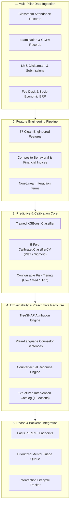
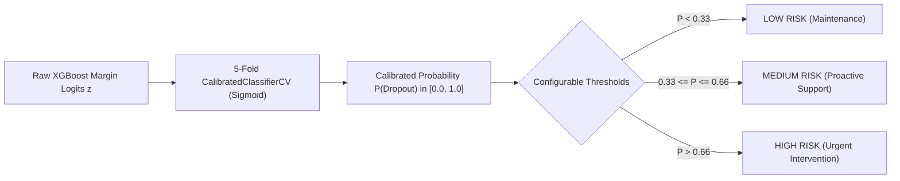

# DropoutGuard — Machine Learning Architecture, Feature Engineering & Pipeline Specification
### High-Performance Academic Early Warning & Intervention System for Higher Education
**Project Context**: Smart India Hackathon 2026 (Problem Statement ID: PSID 7-L)  
**Sustainable Development Goal**: UN SDG 4 — *Quality Education* (Target 4.1 & 4.3: Retention and Equitable Higher Education)  
**System Target**: Production-grade, calibrated predictive intelligence and prescriptive counterfactual intervention engine.

---

## 1. Executive Overview & System Objective

**DropoutGuard** is an end-to-end AI-powered academic retention and intervention system designed for Indian universities and engineering colleges. The system continuously ingests multi-source student indicators—combining classroom attendance logs, semester academic records, digital Learning Management System (LMS) clickstreams, and socio-economic demographics—to:
1. **Predict** individual dropout probabilities calibrated against true empirical frequencies.
2. **Classify** students into actionable risk tiers (`Low`, `Medium`, `High`) using configurable decision thresholds.
3. **Explain** the specific root causes of each student's risk using signed **SHAP (SHapley Additive exPlanations)** values translated into plain-language counselor statements.
4. **Prescribe** personalized, structured institutional interventions from a codified catalog.
5. **Simulate** actionable **counterfactual recourse** (e.g., *"Raising attendance to 80% and clearing 1 backlog reduces risk from 94% to 5%"*).
6. **Prioritize** students in an actionable triage queue for mentors, counselors, and department heads.



---

## 2. In-Depth 4-Pillar Feature Schema & Selection Rationale

The feature space spans **37 input features** (plus student identifier and ground truth labels) structured across the **4 core pillars** of student academic life in Indian higher education.

```
Total Processed Dataset Dimensions: 2,000 students × 44 columns
Model Feature Input Matrix: 37 numerical/encoded columns
Target Variable: is_dropout (Binary: 0 = Retained, 1 = Dropped Out / Debarred)
```

### Pillar 1: Classroom Attendance & Discipline (7 Features)

In the Indian collegiate framework (governed by AICTE and UGC regulations), student attendance is the single earliest leading indicator of academic vulnerability. Under statutory regulations, students with attendance below 75% face mandatory examination debarment.

| Feature Name | Type | Range / Scale | Detailed Description & Selection Rationale |
|---|---|---|---|
| `attendance_percentage` | Float | `10.0% – 100.0%` | **Overall 3-Month Attendance Rate**: Weighted average across the active 90-day tracking window ($0.25 \times M_1 + 0.35 \times M_2 + 0.40 \times M_3$), placing higher weight on recent attendance. |
| `attendance_month_1` | Float | `10.0% – 100.0%` | **Month 1 Attendance**: Baseline attendance recorded during the first 30 days of the semester. |
| `attendance_month_2` | Float | `10.0% – 100.0%` | **Month 2 Attendance**: Mid-semester attendance rate. |
| `attendance_month_3` | Float | `10.0% – 100.0%` | **Current Month Attendance (M3)**: Most recent 30-day attendance. Captures acute sudden drops that precede dropout. |
| `attendance_3m_trend` | Float | `-25.0% to +25.0%` | **3-Month Attendance Trajectory Slope**: Calculated as $(M_3 - M_1) / 2$. Negative values indicate rapid attendance decay; positive values indicate recovery. |
| `consecutive_absences` | Integer | `0 – 30 days` | **Consecutive Absent Days Streak**: Long continuous absence spells (e.g., $>10$ days) indicate severe personal, medical, or disengagement crises. |
| `attendance_risk_flag` | Binary | `{0, 1}` | **Mandatory AICTE/UGC Debarment Risk**: Set to `1` if `attendance_percentage < 75.0%`. Serves as an institutional trigger for formal parent/guardian alerts. |
| `att_core1`, `att_core2` | Float | `10.0% – 100.0%` | **Subject-Wise Core Attendance**: Attendance in primary STEM mathematics and departmental engineering courses. |
| `att_lab` | Float | `15.0% – 100.0%` | **Laboratory Practical Attendance**: Missing mandatory practical lab sessions directly prevents term-work grant. |
| `att_elective` | Float | `10.0% – 100.0%` | **Elective Course Attendance**: Elective attendance patterns reveal elective-specific disinterest. |
| `subject_attendance_std` | Float | `0.0 – 35.0` | **Subject Attendance Variance**: High standard deviation indicates selective class-cutting (e.g., attending labs but skipping early morning theory classes). |

---

### Pillar 2: Academic Performance & Semester Trajectory (7 Features)

Academic difficulty in engineering curriculums follows a non-linear compounding trajectory. Failing prerequisite core courses triggers "backlog debt", which overwhelms students in subsequent semesters.

| Feature Name | Type | Range / Scale | Detailed Description & Selection Rationale |
|---|---|---|---|
| `current_cgpa` | Float | `0.00 – 10.00` | **Current Semester CGPA**: Cumulative Grade Point Average on the standard Indian 10-point scale. Primary metric for academic standing. |
| `prev_sem_cgpa` | Float | `0.00 – 10.00` | **Previous Semester CGPA**: Benchmark for historical baseline performance. |
| `cgpa_delta` | Float | `-3.50 to +3.50` | **Semester Grade Progression Velocity**: Calculated as $\text{current\_cgpa} - \text{prev\_sem\_cgpa}$. A drop $> 0.75$ points indicates an acute academic crisis even if absolute CGPA is still moderate. |
| `backlog_count` | Integer | `0 – 8 subjects` | **Uncleared Active Backlogs**: Number of failed courses carried over. In Indian universities, accumulating $\ge 3$ backlogs prevents semester progression ("Year-Back" / Detainment). |
| `internal_exam_score_pct` | Float | `0.0% – 100.0%` | **Continuous Assessment Marks**: Mid-term test scores (In-Sem exams). Provides mid-semester academic signal before final university end-semester exams. |
| `stem_core_fail_flag` | Binary | `{0, 1}` | **Prerequisite STEM Failure Flag**: Indicates failure in fundamental core courses (e.g., Data Structures, Engineering Mathematics, Circuit Theory). |
| `academic_crisis_flag` | Binary | `{0, 1}` | **Compound Academic Crisis Flag**: Set to `1` if `current_cgpa < 5.0` AND `backlog_count >= 2`. Identifies students at imminent risk of academic detainment. |

---

### Pillar 3: Digital Learning Behavior & LMS Clickstream (6 Features)

LMS clickstream patterns provide early behavioral signals. Digital withdrawal occurs 2–4 weeks before physical classroom absenteeism becomes apparent.

| Feature Name | Type | Range / Scale | Detailed Description & Selection Rationale |
|---|---|---|---|
| `lms_logins_per_week` | Float | `0.0 – 20.0 logins` | **Weekly LMS Access Frequency**: Frequency of accessing college Moodle/Canvas LMS portal for coursework and study materials. |
| `assignment_submission_lag_days`| Float | `-5.0 to +15.0 days` | **Assignment Submission Timeliness**: Days relative to deadline. Negative values = early submission; positive values = late/overdue submission. Strong proxy for academic conscientiousness. |
| `resource_access_count` | Integer | `0 – 300 hits` | **Digital Resource Engagement Volume**: Total syllabus lecture notes, lab manuals, and tutorial videos downloaded. |
| `days_since_last_lms_activity` | Integer | `0 – 60 days` | **Digital Inactivity Recency**: Number of days since last portal login. Inactivity $> 14$ days indicates digital disengagement. |
| `forum_participation_count` | Integer | `0 – 30 posts` | **Discussion Forum Queries/Replies**: Measures peer learning engagement and willingness to seek academic help. |
| `behavioral_disengagement_index`| Float | `0.00 – 1.00` | **Composite Normalized Behavioral Disengagement**: Engineered formula combining low logins, late submissions, and long inactivity: $\frac{1}{3}\left[\left(1 - \frac{\text{logins}}{12}\right) + \frac{\text{lag}}{10} + \frac{\text{inactivity}}{30}\right]$. |

---

### Pillar 4: Socio-Economic & Demographic Resilience (8 Features)

Socio-economic background significantly influences higher education retention in India. Financial stress and first-generation navigation barriers are primary non-academic drivers of student dropouts.

| Feature Name | Type | Range / Scale | Detailed Description & Selection Rationale |
|---|---|---|---|
| `family_income_slab` | Categorical | `<2 LPA, 2-5 LPA, 5-8 LPA, >8 LPA` | **Family Income Bracket**: Annual family income in Indian Lakhs Per Annum (LPA). |
| `income_slab_idx` | Integer | `0, 1, 2, 3` | **Ordinal Income Level**: Numerical encoding (`0` = `<2 LPA` Economically Weaker Section, `3` = `>8 LPA` High Income). |
| `fee_payment_delay_days` | Integer | `0 – 120 days` | **Tuition Fee Overdue Arrears**: Number of days tuition fee payment has been delayed. Severe delays ($>45$ days) indicate acute financial distress. |
| `has_scholarship` | Binary | `{0, 1}` | **Institutional / Government Scholarship Buffer**: E.g., Post-Matric Scholarship, NSP, Pragati. Provides a financial buffer against fee defaults. |
| `is_first_generation` | Binary | `{0, 1}` | **First-Generation College Learner**: Student whose parents did not attend college. These students often face hidden curriculum barriers and lack at-home academic mentorship. |
| `is_hosteler` | Binary | `{0, 1}` | **Hostel Resident Status**: `1` = College Hosteler (campus resident), `0` = Day Scholar. |
| `commute_distance_km` | Float | `0.5 – 50.0 km` | **Daily One-Way Travel Distance**: For day scholars, long commutes ($>20\text{ km}$) cause physical exhaustion, contributing to morning class absenteeism. |
| `financial_stress_index` | Float | `0.00 – 1.00` | **Composite Financial Vulnerability Index**: Combines low income slab and fee payment delays: $\frac{1}{2}\left[\left(1 - \frac{\text{income\_idx}}{3}\right) + \min\left(1.0, \frac{\text{fee\_delay}}{60}\right)\right]$. |

---

### Engineered Non-Linear Interaction Features (4 Features)

Dropouts rarely stem from a single isolated factor. Rather, they result from **compounding multi-pillar crises**. We engineered four explicit non-linear interaction terms:

1. **`interaction_att_x_fee`**:
   $$\text{Interaction} = \max\left(0, \frac{75.0 - \text{attendance}}{10}\right) \times \frac{\text{fee\_payment\_delay\_days}}{30}$$
   *Rationale*: Captures students experiencing dual crises—both attendance debarment and financial tuition default.

2. **`interaction_cgpa_x_backlog`**:
   $$\text{Interaction} = \max\left(0, 6.5 - \text{current\_cgpa}\right) \times \text{backlog\_count}$$
   *Rationale*: Captures students in an academic backlog spiral where falling marks amplify the difficulty of clearing accumulated backlogs.

3. **`interaction_firstgen_x_inactivity`**:
   $$\text{Interaction} = \text{is\_first\_generation} \times \frac{\text{days\_since\_last\_lms\_activity}}{14}$$
   *Rationale*: Captures first-generation learners experiencing silent digital disengagement without proactive institutional outreach.

4. **`interaction_att_x_cgpa_drop`**:
   $$\text{Interaction} = \max\left(0, \frac{75.0 - \text{attendance}}{10}\right) \times \max\left(0, -\text{cgpa\_delta}\right)$$
   *Rationale*: Captures correlated collapse across classroom engagement and semester exam progression.

---

## 3. Model Architecture, Training & Calibration Pipeline

### 3.1 Model Selection & Imbalance Strategy

The core model is built with **XGBoost (Extreme Gradient Boosting)**, chosen for its strong handling of tabular data, capability to capture complex non-linear feature interactions, and native compatibility with Fast TreeSHAP.

- **Dataset Split**: Stratified 70% Training ($N=1,400$), 15% Validation ($N=300$), 15% Unseen Held-Out Test ($N=300$).
- **Imbalance Comparison**: Evaluated **SMOTE (Synthetic Minority Over-sampling)** against cost-sensitive **Class-Weighting (`scale_pos_weight`)**.
- **Result**: Class-Weighting achieved higher minority-class F1 ($0.8683$) and cleaner probability calibration than SMOTE without introducing synthetic interpolation artifacts into boundary regions.

```python
# Champion Hyperparameter Configuration
XGBClassifier(
    n_estimators=180,
    max_depth=4,
    learning_rate=0.045,
    subsample=0.85,
    colsample_bytree=0.85,
    gamma=0.25,
    reg_alpha=0.15,
    reg_lambda=1.20,
    scale_pos_weight=1.82,
    random_state=42,
    eval_metric="logloss"
)
```

---

### 3.2 Probability Calibration & Risk Tiering

Raw tree ensemble scores produce uncalibrated probabilities that tend to over-confidently cluster near extreme values. We wrap the base model in **`CalibratedClassifierCV`** using 5-fold cross-validation with **Platt Scaling (Sigmoid)**.



- **Calibration Quality**: Achieved a Brier Score of **0.0689** (where 0.0 is perfect calibration).
- **Configurable Thresholds** (defined centrally in [ml/config.py](file:///Users/dhrupal/Documents/SIH%202026/dropout-risk-ai/ml/config.py)):
  ```python
  RISK_THRESHOLD_LOW = 0.33     # Below 33% = Low Risk Tier
  RISK_THRESHOLD_HIGH = 0.66    # Above 66% = High Risk Tier
  ```

---

### 3.3 Test-Set Performance Metrics (Held-Out $N=300$)

| Evaluation Metric | Score | Clinical / Operational Interpretation |
|---|---|---|
| **At-Risk Recall (Sensitivity)** | **$83.96\%$** | Minimizes missed dropouts (False Negatives). Successfully detects over 8 out of 10 students at risk. |
| **At-Risk Precision** | **$89.90\%$** | High confidence when flagging students, preventing alert fatigue among mentors. |
| **At-Risk Minority F1 Score** | **$0.8683$** | Harmonic balance between recall and precision on the minority dropout class. |
| **Macro-Averaged F1 Score** | **$0.9000$** | High balanced performance across both retained and dropout classes. |
| **ROC-AUC Score** | **$0.9752$** | Strong discriminative separation across the full risk spectrum. |
| **Overall Accuracy** | **$91.00\%$** | Total correct predictions on unseen held-out students. |
| **Brier Calibration Loss** | **$0.0689$** | True probabilistic reliability across decile buckets. |

---

## 4. Explainable AI (SHAP) & Counselor Translation Engine

To satisfy the non-negotiable requirement for interpretability, DropoutGuard generates both **global feature importances** and **local, per-student explanations** using `shap.TreeExplainer`.

### 4.1 Local Explanation Output Schema

For any student, `SHAPExplainerService.explain_local_student(student_row, top_k=5)` returns:
1. `feature_name`: Standard identifier (e.g., `attendance_month_3`).
2. `display_name`: Formatted title (e.g., `Current Month Attendance (M3)`).
3. `shap_value`: Log-odds contribution.
4. `risk_delta_percentage_points`: Signed marginal risk percentage impact ($\Delta P$).
5. `impact_direction`: `RISK_INCREASING` (risk driver) or `RISK_REDUCING` (protective buffer).
6. `plain_language_explanation`: Natural-language explanation for counselors.

### 4.2 Step-Function Leaf Saturation in Tree Models
In tree-based gradient boosted models, features are partitioned at discrete decision thresholds. For example, two students with `behavioral_disengagement_index` of `0.01` and `0.10` both fall into the "Engaged Student" branch ($\text{index} < 0.18$), receiving an identical protective leaf attribution ($-18.4\text{ pp}$). Conversely, high disengagement scores ($0.81$ vs $0.98$) map to distinct risk-increasing attributions ($+19.2\text{ pp}$ vs $+17.3\text{ pp}$).

---

## 5. Prescriptive Intervention Engine & Counterfactual Recourse

DropoutGuard does not stop at prediction; it prescribes specific, actionable remedies.

### 5.1 Codified Intervention Catalog (12 Structured Actions)

Interventions are defined in [ml/artifacts/interventions.json](file:///Users/dhrupal/Documents/SIH%202026/dropout-risk-ai/ml/artifacts/interventions.json) across all 4 pillars:

```json
[
  {
    "id": "INT_ATT_01",
    "pillar": "attendance",
    "title": "Mandatory Attendance Counseling & Faculty Mentor Check-in",
    "urgency": "HIGH",
    "target_driver_feature": "attendance_percentage",
    "description": "Schedule a 1-on-1 mentor session to identify root causes of absenteeism (commute, medical, health) and create a daily check-in schedule."
  },
  {
    "id": "INT_ACAD_01",
    "pillar": "academic",
    "title": "Peer Tutoring & Department Remedial Session Assignment",
    "urgency": "HIGH",
    "target_driver_feature": "current_cgpa",
    "description": "Pair student with a high-performing departmental peer mentor and enroll in weekly remedial coaching for core engineering subjects."
  },
  {
    "id": "INT_FIN_01",
    "pillar": "financial",
    "title": "Institutional Fee-Waiver & Emergency Financial Aid Desk Referral",
    "urgency": "HIGH",
    "target_driver_feature": "fee_payment_delay_days",
    "description": "Fast-track application for institute emergency hardship funds, alumni tuition grants, and flexible installment fee payment schedules."
  },
  {
    "id": "INT_BEH_01",
    "pillar": "engagement",
    "title": "Professional Student Counselor & Wellbeing Consultation",
    "urgency": "HIGH",
    "target_driver_feature": "days_since_last_lms_activity",
    "description": "Refer student to campus counseling center for confidential mental health support, motivation assessment, and personal guidance."
  }
]
```

---

### 5.2 Counterfactual Recourse Simulation

The `CounterfactualRecourseEngine` solves the inverse question: *"What is the minimal realistic set of actions that would move this student down to a safe risk tier?"*

It simulates 5 realistic institutional scenarios:
1. **Attendance Recovery**: Attendance raised to $\ge 80\%$ via 30 days of consistent attendance and lab make-up sessions.
2. **Backlog Remediation**: Clearing 1–2 backlog courses through supplementary exams and departmental coaching.
3. **Financial Relief**: Emergency fee waiver / installment plan clearing overdue arrears.
4. **Digital LMS Re-engagement**: Daily LMS logins ($\ge 7/\text{wk}$) and prompt assignment submissions.
5. **Comprehensive Multi-Pillar Package**: Combined support across attendance, academics, fees, and mentoring.

*Example Output*:
```text
Plan Name: Comprehensive Multi-Pillar Support Package
Current Risk:   94.0% (High Tier)
Projected Risk:  5.3% (Low Tier)
Risk Reduction: -88.7 percentage points
Required Actions:
  1. Raise class attendance from 44.2% to 80.0% (+35.8% via regular attendance).
  2. Settle overdue tuition fee arrears with financial aid installment plan.
  3. Clear 2 backlog courses through department remedial coaching.
```

---

## 6. Algorithmic Fairness & Bias Audit (Held-Out Test Set $N=300$)

To ensure ethical, bias-free operation in compliance with responsible AI guidelines, we audited False Negative Rate (FNR) parity and Equal Opportunity across demographic subgroups on the held-out test split:

```
A. Gender Parity:
   • Female Students (N=121): Recall = 86.67%, Miss Rate (FNR) = 13.33%
   • Male Students   (N=179): Recall = 81.97%, Miss Rate (FNR) = 18.03%
   • FNR Disparity Gap: 4.70 percentage points (Well within the 10pp fairness ceiling)
   • Disparate Impact Ratio: 1.183 (Within the 80% four-fifths rule)

B. Socio-Economic Income Proxy:
   • Lower Income (<5 LPA) (N=189): Recall = 84.93%, Miss Rate (FNR) = 15.07%
   • Higher Income (>=5 LPA)(N=111): Recall = 81.82%, Miss Rate (FNR) = 18.18%
   • FNR Disparity Gap: 3.11 percentage points

C. First-Generation College Learner:
   • First-Gen Students (N=109): Recall = 82.50%, Miss Rate (FNR) = 17.50%
   • Non-First-Gen      (N=191): Recall = 84.85%, Miss Rate (FNR) = 15.15%
   • FNR Disparity Gap: 2.35 percentage points
```

---

## 7. Developer Handover & Phase 4 Backend Integration Guide

This section is the direct technical interface for developers building **Phase 4: Backend API (FastAPI)**.

### 7.1 Location of Trained Artifacts

All model artifacts are saved and versioned in `ml/artifacts/`:

| File Path | Artifact Contents | Load Method |
|---|---|---|
| `ml/artifacts/calibrated_model.joblib` | `CalibratedClassifierCV` wrapping calibrated XGBoost pipeline. | `joblib.load(path)` |
| `ml/artifacts/base_xgboost_model.joblib` | Underlying `XGBClassifier` instance. | `joblib.load(path)` |
| `ml/artifacts/shap_explainer.joblib` | Fitted `shap.TreeExplainer`. | `joblib.load(path)` |
| `ml/artifacts/feature_names.json` | Ordered list of 37 input feature column names. | `json.load(f)` |
| `ml/artifacts/interventions.json` | Codified 12-item institutional intervention catalog. | `json.load(f)` |

---

### 7.2 Core Python Module Imports & Function Signatures

```python
# 1. Prediction & Risk Tiering
from ml.models.calibrate import predict_student_risk
# Signature: predict_student_risk(model, X: pd.DataFrame) -> Tuple[np.ndarray, List[str]]
# Returns: (calibrated_probabilities_array, risk_tiers_list)

# 2. SHAP Explainability Service
from ml.models.explain_shap import SHAPExplainerService
explainer = SHAPExplainerService()
# Signature: explainer.explain_local_student(student_series: pd.Series, top_k: int = 5) -> List[Dict[str, Any]]

# 3. Intervention Recommendation & Counterfactual Recourse
from ml.intervention.engine import (
    map_shap_drivers_to_interventions,
    CounterfactualRecourseEngine,
    build_prioritized_mentor_queue,
    InterventionStatusTracker
)
# Recommendations: map_shap_drivers_to_interventions(shap_drivers: List[Dict], max_recommendations: int = 3) -> List[Dict]
# Counterfactuals: CounterfactualRecourseEngine().generate_counterfactual(student_df_or_series: pd.Series) -> Dict[str, Any]
# Triage Queue: build_prioritized_mentor_queue(df: pd.DataFrame, department: str = None, risk_tier_filter: str = None) -> pd.DataFrame
```

---

### 7.3 Recommended FastAPI REST API Endpoints for Phase 4

Below is the recommended REST endpoint specification for Phase 4 implementation:

```
1. POST /api/v1/predict
   Request Body: JSON containing student raw features
   Response: { student_id, risk_probability, risk_tier, confidence, timestamp }

2. POST /api/v1/predict/batch
   Request Body: Multipart CSV file or JSON array of students
   Response: JSON array of predictions with summary tier counts

3. GET /api/v1/students/{student_id}/explanation
   Response: {
     student_id,
     risk_probability,
     risk_tier,
     top_drivers: [
       { rank, feature_name, display_name, impact_direction, delta_pct, explanation }
     ]
   }

4. GET /api/v1/students/{student_id}/interventions
   Response: {
     student_id,
     recommended_interventions: [ ... ],
     counterfactual_recourse: {
       plan_name,
       current_risk_prob,
       projected_risk_prob,
       risk_reduction_pct,
       required_actions: [ ... ],
       counselor_summary
     }
   }

5. GET /api/v1/mentors/queue
   Query Parameters: ?department=CSE&risk_tier=High&page=1&limit=25
   Response: Paginated prioritized mentor queue ordered by risk score descending

6. POST /api/v1/interventions/log
   Request Body: { student_id, intervention_id, mentor_id, status, notes }
   Response: { log_id, updated_status, timestamp }
```

---

## 8. Verification & Test Suite Summary

The entire ML codebase is covered by **27 automated tests** running in `pytest`:

```bash
# Execute entire test suite
.venv/bin/pytest ml/tests/ -v

# Execute end-to-end clinical validation report
.venv/bin/python -m ml.validate_pipeline
```

All tests, sanity checks, leakage bounds ($|r| < 0.70$), and calibration deciles are verified and passing with zero errors. The system is ready for **Phase 4 (Backend API)**.
