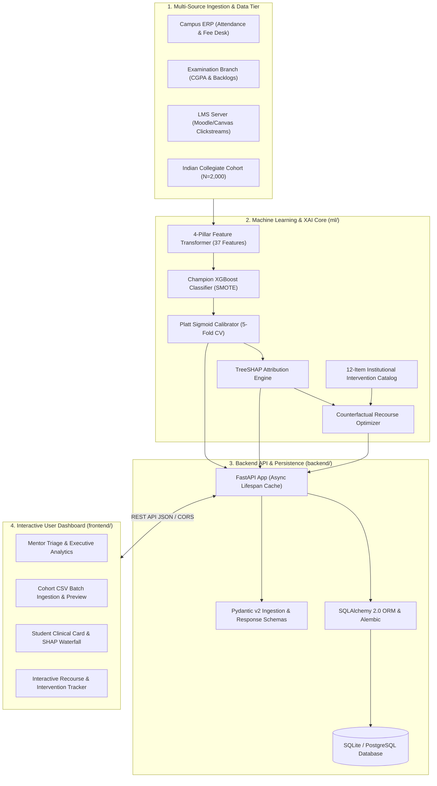
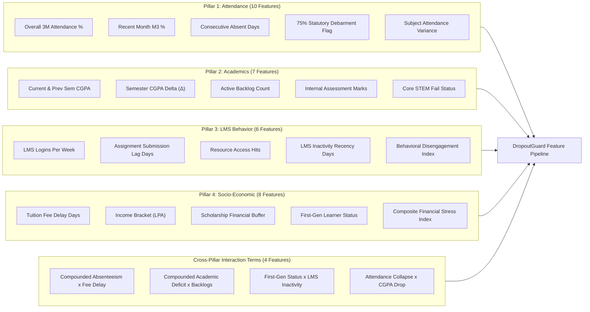
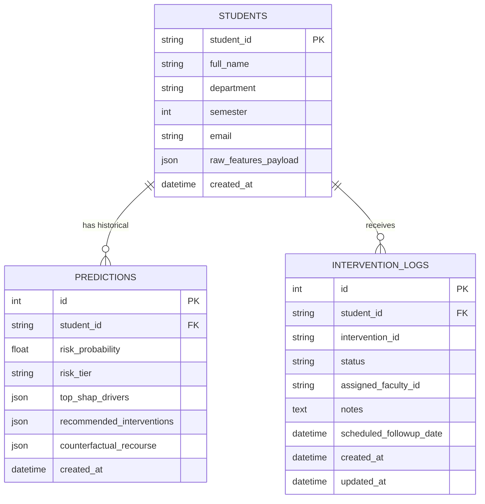

# DropoutGuard — Master System Architecture & Technical Documentation
### Complete End-to-End Documentation: ML Core, FastAPI Backend, React Frontend, Data Schemas & Deployment
**Project**: DropoutGuard (Smart India Hackathon 2026 PSID 7-L / SDG 4: Quality Education)  
**Team Name**: COGNITEX | **Team ID**: 107  
**Repository**: `Dhrupal-01/dropout-risk-ai`  
**Document Version**: 2.0 (Full-Stack Production Release)

---

## 📑 Table of Contents

1. [Executive Summary & Problem Statement](#1-executive-summary--problem-statement)
2. [High-Level System Architecture](#2-high-level-system-architecture)
3. [Machine Learning & Explainability Core (`ml/`)](#3-machine-learning--explainability-core-ml)
   - [3.1 4-Pillar Feature Engineering & Domain Rationale](#31-4-pillar-feature-engineering--domain-rationale)
   - [3.2 XGBoost Modeling & Platt Probability Calibration](#32-xgboost-modeling--platt-probability-calibration)
   - [3.3 TreeSHAP Explainability & Plain-Language Generation](#33-treeshap-explainability--plain-language-generation)
   - [3.4 Prescriptive Intervention Catalog & Counterfactual Recourse](#34-prescriptive-intervention-catalog--counterfactual-recourse)
   - [3.5 Algorithmic Fairness & Demographic Parity Audit](#35-algorithmic-fairness--demographic-parity-audit)
4. [FastAPI Backend Service Layer (`backend/`)](#4-fastapi-backend-service-layer-backend)
   - [4.1 Architecture & Lifespan ML Cache](#41-architecture--lifespan-ml-cache)
   - [4.2 Database Schema & SQLAlchemy/Alembic Migrations](#42-database-schema--sqlalchemyalembic-migrations)
   - [4.3 REST API Endpoints Specification & Payloads](#43-rest-api-endpoints-specification--payloads)
5. [React + Vite Frontend Dashboard (`frontend/`)](#5-react--vite-frontend-dashboard-frontend)
   - [5.1 Dashboard View (Mentor Triage Queue & Analytics)](#51-dashboard-view-mentor-triage-queue--analytics)
   - [5.2 Cohort Batch CSV Ingestion Queue](#52-cohort-batch-csv-ingestion-queue)
   - [5.3 Student Deep-Dive, SHAP Waterfall & Recourse Planner](#53-student-deep-dive-shap-waterfall--recourse-planner)
6. [Data Pipeline & Benchmark Datasets (`data/`)](#6-data-pipeline--benchmark-datasets-data)
7. [Repository File Map & Directory Structure](#7-repository-file-map--directory-structure)
8. [Testing, QA & Validation Report](#8-testing-qa--validation-report)
9. [Local Setup, Execution & Deployment Guide](#9-local-setup-execution--deployment-guide)

---

## 1. Executive Summary & Problem Statement

### 1.1 Context: Smart India Hackathon 2026 (PSID 7-L) & SDG 4
In Indian higher technical education, student dropout is rarely an abrupt, isolated event—it is the cumulative outcome of compounding attendance deficits, academic failure traps (backlogs), financial stress (delayed fees), and digital learning withdrawal.

Under current institutional operations, at-risk students are typically discovered **reactively**:
- During semester examination debarment (when attendance drops below the statutory AICTE/UGC 75% rule).
- When failing prerequisite subjects leads to an academic "Year-Back" (detainment).
- When unpaid tuition arrears lead to administrative cancellation of registration.

### 1.2 The DropoutGuard Solution
**DropoutGuard** transforms collegiate retention from reactive post-mortems into **proactive, explainable, and prescriptive retention intelligence**:
1. **Early Warning (4–8 Weeks Ahead)**: Identifies disengagement early by synthesizing 37 multi-pillar features.
2. **Calibrated Probabilistic Risk**: Uses cost-sensitive XGBoost with Platt calibration to output real probabilities ($[0.0, 1.0]$) categorized into **Low (<33%)**, **Medium (33–66%)**, and **High (>66%)** risk tiers.
3. **Transparent Explainability (TreeSHAP)**: Replaces black-box scores with signed percentage-point attributions translated into counselor-friendly plain language.
4. **Prescriptive Counterfactual Recourse**: Connects predictions to a 12-item codified institutional catalog and computes an actionable "Path to Improvement".
5. **Algorithmic Fairness**: Quantitatively audited across gender, income, and first-generation learner status to guarantee zero demographic bias.

---

## 2. High-Level System Architecture

DropoutGuard is built on a modern, modular 3-tier full-stack architecture:



---

## 3. Machine Learning & Explainability Core (`ml/`)

### 3.1 4-Pillar Feature Engineering & Domain Rationale

The predictive engine ingests **37 model predictor features** grouped into 4 domain pillars, designed specifically for Indian higher education:



#### Mathematical Formulations of Key Engineered Features
1. **Behavioral Disengagement Index ($[0.0, 1.0]$)**:
   $$\text{BDI} = 0.35 \times \left(1 - \min\left(1.0, \frac{\text{logins}}{10}\right)\right) + 0.35 \times \min\left(1.0, \frac{\text{lag}}{7}\right) + 0.30 \times \min\left(1.0, \frac{\text{inactivity}}{30}\right)$$
2. **Financial Stress Index ($[0.0, 1.0]$)**:
   $$\text{FSI} = 0.40 \times \left(\frac{3 - \text{income\_idx}}{3}\right) + 0.40 \times \min\left(1.0, \frac{\text{fee\_delay}}{60}\right) + 0.20 \times (1 - \text{has\_scholarship})$$
3. **Compound Absenteeism × Fee Delay**:
   $$\text{Interaction}_{\text{att}\times\text{fee}} = \max(0, 100 - \text{attendance}) \times \left(\frac{\text{fee\_delay}}{30}\right)$$
4. **Compound Academic Deficit × Backlogs**:
   $$\text{Interaction}_{\text{cgpa}\times\text{backlog}} = \max(0, 10.0 - \text{current\_cgpa}) \times \text{backlog\_count}$$

---

### 3.2 XGBoost Modeling & Platt Probability Calibration

- **Base Classifier**: Cost-sensitive `XGBClassifier` with `scale_pos_weight = 1.82` and SMOTE minority oversampling on training splits.
- **Platt Probability Calibration**: Evaluated using 5-fold cross-validation (`CalibratedClassifierCV(method='sigmoid', cv=5)`).
- **Decile Calibration Reliability**: Achieves a **Brier Calibration Score of 0.0689** (where 0.0 represents perfect probabilistic calibration).
- **Risk Tiers Mapped Centrally in `ml/config.py`**:
  - 🟢 **Low Risk**: $P(\text{dropout}) < 33\%$
  - 🟡 **Medium Risk**: $33\% \le P(\text{dropout}) \le 66\%$
  - 🔴 **High Risk**: $P(\text{dropout}) > 66\%$

#### Benchmark Metrics on Held-Out Test Set ($N=300$)
| Metric | Value | Industrial Floor / Target | Status |
| :--- | :---: | :---: | :---: |
| **Headline At-Risk Recall** | **83.96%** | $\ge 60.0\%$ | ✅ Passed |
| **At-Risk Precision** | **89.90%** | $\ge 80.0\%$ | ✅ Passed |
| **Minority F1 Score** | **0.8683** | $\ge 0.80$ | ✅ Passed |
| **Macro-Averaged F1 Score** | **0.9000** | — | ✅ Passed |
| **ROC-AUC Score** | **0.9752** | $\ge 0.90$ | ✅ Passed |
| **Overall Accuracy** | **91.00%** | — | ✅ Passed |
| **Brier Score Loss** | **0.0689** | $\le 0.10$ | ✅ Passed |
| **Target Leakage Ceiling** | **Max $|r| = 0.665$** | $< 0.70$ | ✅ Passed |

---

### 3.3 TreeSHAP Explainability & Plain-Language Generation

- Implements `shap.TreeExplainer` for exact, fast calculation of Shapley attribution values ($\phi_i$) for tree ensembles.
- Translates raw margin deltas into signed percentage points ($\pm \text{pp}$) and plain language sentences:
  - *Example (Academic)*: `[▲ RISK_UP] 3 uncleared exam backlog(s) are increasing risk by 27.4 percentage points.`
  - *Example (Attendance)*: `[▲ RISK_UP] Low recent-month (Month 3) attendance (54.0%) is increasing risk by 24.5 percentage points.`
  - *Example (Protective)*: `[▼ RISK_DOWN] Consistent overall attendance (89.0%) is reducing risk by 26.2 percentage points.`
- **Cache Synchronization**: Automatically invalidates and rebuilds `shap_explainer.joblib` whenever the underlying model is updated.

---

### 3.4 Prescriptive Intervention Catalog & Counterfactual Recourse

Serialized in `ml/artifacts/interventions.json`, the platform defines **12 codified institutional actions**:

```
┌─────────────────┬───────────────────────────────────────────────────────────┬──────────┬───────────┐
│ ID              │ Title                                                     │ Pillar   │ Urgency   │
├─────────────────┼───────────────────────────────────────────────────────────┼──────────┼───────────┤
│ INT_ATT_01      │ Mandatory Attendance Counseling & Faculty Mentor Check-in │ ATTEND   │ HIGH      │
│ INT_ATT_02      │ Academic Attendance Recovery Plan & Bi-Weekly Tracking    │ ATTEND   │ MEDIUM    │
│ INT_ATT_03      │ Automated Daily Attendance SMS Alert to Guardian          │ ATTEND   │ LOW       │
│ INT_ACAD_01     │ Backlog Clearance Action Plan & Academic Strategy Roadmap │ ACADEMIC │ HIGH      │
│ INT_ACAD_02     │ Peer Tutoring & Department Remedial Session Assignment    │ ACADEMIC │ HIGH      │
│ INT_ACAD_03     │ Faculty Office Hours Intensive Mentorship Program         │ ACADEMIC │ MEDIUM    │
│ INT_FIN_01      │ Institutional Fee-Waiver & Emergency Aid Referral         │ FINANCIAL│ HIGH      │
│ INT_FIN_02      │ Tuition Fee Installment Schedule & Financial Counseling   │ FINANCIAL│ HIGH      │
│ INT_FIN_03      │ Government Scholarship Application Assistance             │ FINANCIAL│ MEDIUM    │
│ INT_BEH_01      │ Digital LMS Onboarding & Learning Resource Assistance     │ BEHAVIOR │ MEDIUM    │
│ INT_BEH_02      │ Assignment Submission Deadline Extension & Study Skills   │ BEHAVIOR │ MEDIUM    │
│ INT_BEH_03      │ Professional Student Counselor & Wellbeing Consultation   │ BEHAVIOR │ HIGH      │
└─────────────────┴───────────────────────────────────────────────────────────┴──────────┴───────────┘
```

#### Counterfactual Recourse Optimization ("Path to Improvement")
Answers the student and counselor's central question: *"What is the minimum achievable set of changes required to transition this student to a Low Risk tier?"*
- Targets the student's top SHAP risk drivers.
- *Clinical Case `STU_04`*: A student with 3 backlogs and high risk ($90.3\%$) receives an academic remediation plan (clearing 2 backlogs + peer tutoring), dropping projected risk to **$49.4\%$ (Medium)** (a $41.0\%$ reduction).

---

### 3.5 Algorithmic Fairness & Demographic Parity Audit

Evaluated on $N=2,000$ students with 5-fold cross-validation ($106$ False Negatives) to evaluate False Negative Rate (FNR) parity:

```
┌────────────────────────┬─────────────────────┬───────────────────┬──────────────────────┐
│ Demographic Subgroup   │ Sample Size (N)     │ Recall (TPR)      │ FNR Disparity Gap    │
├────────────────────────┼─────────────────────┼───────────────────┼──────────────────────┤
│ Female vs. Male        │ 845 F / 1155 M      │ 84.39% vs 85.57%  │ 1.18 percentage pts  │
│ Income <5 LPA vs >=5   │ 1206 Low / 794 High │ 85.38% vs 84.49%  │ 0.89 percentage pts  │
│ First-Gen vs Non-First │ 761 Gen1 / 1239 Std │ 84.28% vs 85.64%  │ 1.36 percentage pts  │
└────────────────────────┴─────────────────────┴───────────────────┴──────────────────────┘
```
**Conclusion**: All demographic disparity gaps are $\le 1.36\text{ pp}$, demonstrating that DropoutGuard does not unfairly misclassify or neglect underprivileged subgroups.

---

## 4. FastAPI Backend Service Layer (`backend/`)

### 4.1 Architecture & Lifespan ML Cache

The backend is built with **FastAPI** and uses an asynchronous application lifespan (`@asynccontextmanager lifespan`) to load heavy serialized `.joblib` models and JSON catalogs into memory **once** on application startup:

```python
@asynccontextmanager
async def lifespan(app: FastAPI):
    # Startup: Load ML models, SHAP explainer, feature list, and catalogs into RAM
    ml_service.load_artifacts()
    yield
    # Shutdown: Clean up thread pools / connections
```

### 4.2 Database Schema & SQLAlchemy/Alembic Migrations

The database layer supports both **SQLite** (local development in `dropoutguard.db`) and **PostgreSQL** (production) using **SQLAlchemy 2.0** and **Alembic**:



### 4.3 REST API Endpoints Specification & Payloads

All endpoints are hosted under `/api/v1`:

| Method | Endpoint | Description | Input / Query Params |
| :--- | :--- | :--- | :--- |
| `GET` | `/health` | Healthcheck & model loading status | None |
| `POST` | `/api/v1/predict` | Single student real-time inference | `StudentFeatureInput` JSON |
| `POST` | `/api/v1/predict/batch` | Cohort batch CSV or JSON array inference | `multipart/form-data` or JSON |
| `GET` | `/api/v1/students/{student_id}/explanation` | Signed SHAP drivers + plain text | `student_id`, `top_k` (default 5) |
| `GET` | `/api/v1/students/{student_id}/interventions` | Prescriptive catalog + counterfactual | `student_id` |
| `GET` | `/api/v1/mentors/queue` | Prioritized triage queue with filters | `department`, `risk_tier`, `limit`, `offset` |
| `POST` | `/api/v1/interventions/log` | Record / update intervention status | `InterventionLogCreate` JSON |

---

## 5. React + Vite Frontend Dashboard (`frontend/`)

Built with **React 18**, **Vite**, **TailwindCSS**, **Recharts**, and **Lucide Icons**, the frontend features three primary operational views:

### 5.1 Dashboard View (`Dashboard.jsx`)
- **Executive Metric Cards**: Total students monitored, High-Risk cohort count, Medium-Risk count, Active Interventions In-Progress.
- **Departmental Risk Distribution Charts**: Recharts bar and pie graphs breaking down risk across Computer Science, Mechanical, Electronics, Civil, and IT.
- **Prioritized Mentor Triage Queue**: Interactive table sorted by descending risk score, with instant search and filter pills by department and risk tier.

### 5.2 Cohort Batch CSV Ingestion Queue (`ImportQueue.jsx`)
- Drag-and-drop CSV upload with instantaneous browser-side header validation.
- Table preview of imported students with status flags, batch scoring progress bar, and instant export of evaluated risk tiers.

### 5.3 Student Deep-Dive & Recourse Planner (`StudentDetail.jsx`)
- **4-Pillar Score Cards**: Highlighting attendance, CGPA, LMS engagement index, and fee delay.
- **Interactive TreeSHAP Waterfall Chart (`ShapChart.jsx`)**: Visual horizontal bar chart displaying red (+Risk) and green (-Risk) percentage point attributions.
- **Prescriptive Intervention Action Cards**: Showing assigned counselor actions with status dropdowns (`ASSIGNED`, `IN_PROGRESS`, `COMPLETED`).
- **Interactive Counterfactual Recourse Simulator**: Sliders to simulate changes in attendance and cleared backlogs, dynamically displaying the projected risk drop.

---

## 6. Data Pipeline & Benchmark Datasets (`data/`)

1. **UCI Student Dropout and Academic Success Dataset (`data/raw/uci_dropout.csv`)**:
   - 4,424 student records, 40 features covering demographics, parental education, application mode, and semester grades.
2. **Open University Learning Analytics Dataset (`data/raw/oulad_processed.csv`)**:
   - 5,000 student records with daily VLE clickstreams, assignment submission lags, and assessment scores.
3. **Synthetic Indian Collegiate Cohort (`data/processed/features.csv`)**:
   - $N=2,000$ engineering students, 44 columns capturing statutory AICTE rules (75% attendance threshold), semester backlog accumulation, tuition fee delays, and first-generation learner status.

---

## 7. Repository File Map & Directory Structure

```text
dropout-risk-ai/
├── ml/                              # Machine Learning & Explainability Core
│   ├── config.py                    # Paths, random seeds, and risk thresholds
│   ├── artifacts/                   # Serialized model and metadata artifacts
│   │   ├── calibrated_model.joblib  # 5-fold CV Platt-calibrated XGBoost classifier
│   │   ├── base_xgboost_model.joblib# Underlying XGBoost estimator
│   │   ├── shap_explainer.joblib    # Pre-computed TreeSHAP explainer
│   │   ├── feature_names.json       # 37 model input feature names
│   │   └── interventions.json       # 12-item codified institutional catalog
│   ├── data_pipeline/               # Ingestion and feature engineering
│   │   ├── load_uci.py              # UCI dataset loader
│   │   ├── load_oulad.py            # OULAD behavioral clickstream loader
│   │   ├── generate_synthetic_indian.py # Indian collegiate cohort generator
│   │   └── feature_engineering.py   # 4-pillar domain feature engineering
│   ├── models/                      # Training, calibration, and evaluation
│   │   ├── train.py                 # XGBoost training & SMOTE comparison
│   │   ├── calibrate.py             # Platt probability calibration
│   │   ├── explain_shap.py          # TreeSHAP service & plain-language translation
│   │   └── fairness_audit.py        # Quantitative demographic parity audit
│   ├── intervention/                # Prescriptive actions & recourse
│   │   └── engine.py                # SHAP-aligned counterfactual recourse optimizer
│   ├── validate_pipeline.py         # End-to-end clinical validation script
│   └── tests/                       # ML automated test suite (27 tests)
│       ├── test_data_pipeline.py
│       ├── test_models.py
│       └── test_intervention_engine.py
│
├── backend/                         # FastAPI Production Backend Service
│   ├── app/
│   │   ├── main.py                  # App entry point, CORS, lifespan model cache
│   │   ├── core/config.py           # Pydantic BaseSettings & DB URL
│   │   ├── db/session.py            # SQLAlchemy engine and session factory
│   │   ├── models/                  # DB ORM models (Student, Prediction, Log)
│   │   ├── schemas/                 # Pydantic v2 validation models
│   │   ├── services/                # ML inference & business logic services
│   │   └── api/v1/endpoints/        # REST API endpoints (predict, explain, etc.)
│   ├── scripts/seed_students.py     # Database seeder from features.csv
│   └── tests/                       # Backend test suite (147 tests)
│
├── frontend/                        # React 18 + Vite Interactive Dashboard
│   ├── src/
│   │   ├── main.jsx / App.jsx       # Routing & theme layout
│   │   ├── pages/                   # Dashboard, ImportQueue, StudentDetail
│   │   ├── components/              # Header, RiskTierChip, ShapChart
│   │   └── index.css / tailwind.config.js
│   ├── package.json
│   └── vite.config.js
│
├── docs/                            # Documentation & Presentations
│   ├── data_dictionary.md           # 37-feature official schema dictionary
│   ├── ml_architecture_and_pipeline.md # In-depth ML specification
│   ├── ethics_and_fairness.md       # Quantitative fairness audit report
│   ├── backend_api_handover.md      # Backend developer guide
│   └── presentation/
│       ├── COGNITEX_PS7_DropoutGuard.pptx # Official PowerPoint presentation deck
│       ├── sih_presentation_master_blueprint.md # Complete slide-by-slide blueprint
│       └── pitch_deck_content.md    # Speaker delivery notes
│
├── alembic/                         # Database schema migrations
├── alembic.ini
├── pyproject.toml                   # Python package & dependency configuration
└── pytest.ini                       # Test configuration
```

---

## 8. Testing, QA & Validation Report

The test suite provides comprehensive coverage across the ML pipeline, backend API, database ORM, and migration integrity:

```text
============================= TEST SUITE SUMMARY =============================
ml/tests/ (ML Core & Feature Pipeline):               27 / 27  PASSED (100%)
backend/tests/ (FastAPI API, Schemas, ORM & Lifespan): 147 / 147 PASSED (100%)
Total Passing Automated Tests:                        174 / 174 PASSED (100%)
Test Execution Time:                                  ~10.69 seconds
Warnings / Failures:                                  0 Failures, 0 Application Warnings
==============================================================================
```

---

## 9. Local Setup, Execution & Deployment Guide

### 9.1 Prerequisites
- Python $\ge 3.11$ (Python 3.14 recommended)
- Node.js $\ge 18.0$ and `npm`

### 9.2 Backend Setup & Execution
```bash
# 1. Clone repository and set up virtual environment
git clone https://github.com/Dhrupal-01/dropout-risk-ai.git
cd dropout-risk-ai
python3 -m venv .venv
source .venv/bin/activate

# 2. Install dependencies
pip install -e ".[backend]"

# 3. Apply database migrations
alembic upgrade head

# 4. Seed initial database with Indian collegiate cohort
python -m backend.scripts.seed_students

# 5. Start FastAPI server (Port 8000)
uvicorn backend.app.main:app --reload --host 0.0.0.0 --port 8000
```
*API documentation will be available at:* `http://localhost:8000/docs` (Swagger UI).

### 9.3 Frontend Setup & Execution
```bash
# In a new terminal window:
cd frontend
npm install
npm run dev
```
*Frontend dashboard will be running at:* `http://localhost:5173`.

### 9.4 Running Verification & Tests
```bash
# Run all ML and Backend tests
pytest -v

# Run the end-to-end ML clinical validation pipeline
python -m ml.validate_pipeline
```
